# 📊 BUSINESS FLOW & USE CASE ANALYSIS

## Hệ Thống Quản Lý Đào Tạo - Training Management System (TMS)

**Document Version:** 1.0  
**Date:** 31/10/2025  
**Status:** Draft  
**Related Documents:** `prd.md`, `schema.sql`, `business-context.md`

---

## 1. TỔNG QUAN HỆ THỐNG

### 1.1 System Context

**Tên hệ thống:** Training Management System (TMS/EMS - Education Management System)

**Mục đích:** 
Quản lý toàn bộ vòng đời đào tạo từ thiết kế giáo trình → tạo lớp → ghi danh học viên → giảng dạy → điểm danh → đánh giá → cấp chứng chỉ, dành cho các trung tâm đào tạo ngôn ngữ đa chi nhánh.

**Scope:**
- ✅ Curriculum design & approval
- ✅ Class scheduling & resource management
- ✅ Student enrollment & attendance tracking
- ✅ Request management (absence, makeup, transfer, reschedule)
- ✅ Assessment & grading
- ✅ Quality assurance & reporting
- ❌ Payment processing (out of scope v1.0)
- ❌ Certificate printing (out of scope v1.0)

**Boundaries:**
- **Internal**: Tất cả operations từ curriculum → graduation
- **External Integration**: Email notifications, Zoom API, Cloud storage
- **Out of scope**: Financial management, HR payroll, Marketing automation

**Key Stakeholders:**
- **Business**: Center Directors, Branch Managers
- **Operations**: Academic Affairs, Subject Leaders
- **Users**: Teachers, Students
- **Technical**: Development Team, QA Team

---

### 1.2 Actors (Các Vai trò)

| Actor | Mô tả | Responsibilities | System Access Level |
|-------|-------|------------------|---------------------|
| **ADMIN** | Quản trị hệ thống | - Quản lý users và roles<br>- Cấu hình system settings<br>- Toàn quyền truy cập | System-wide admin |
| **MANAGER** | Giám đốc/Quản lý cấp cao | - Approve courses (strategic)<br>- Monitor KPIs across branches<br>- Executive decisions | Multi-branch oversight |
| **CENTER HEAD** | Trưởng chi nhánh | - Approve classes for branch<br>- Monitor branch performance<br>- Manage branch resources | Branch-level admin |
| **SUBJECT LEADER** | Trưởng bộ môn | - Design subjects & courses<br>- Define PLOs/CLOs<br>- Create course materials | Curriculum design |
| **ACADEMIC AFFAIR** | Giáo vụ | - Create & manage classes<br>- Enroll students<br>- Process requests (student/teacher)<br>- Assign resources & teachers | Branch operations |
| **TEACHER** | Giáo viên | - Teach sessions<br>- Record attendance<br>- Grade assessments<br>- Submit requests (swap/reschedule) | Teaching & grading |
| **STUDENT** | Học viên | - View schedule & grades<br>- Submit requests (absence/makeup/transfer)<br>- Provide feedback | Learning portal |
| **QA** | Đảm bảo chất lượng | - Monitor teaching quality<br>- Create QA reports<br>- Track CLO achievement | Quality monitoring |

---

## 2. BUSINESS FLOW DIAGRAMS

### 2.1 High-Level Business Flow (System Overview)


---

### 2.2 Detailed Business Flows

#### 📌 FLOW 1: Curriculum Design & Approval


**Mô tả chi tiết:**

**1. Create Subject (Subject Leader)**
- Input: code (unique), name, description
- Validation: Code không trùng, name required
- Business logic: Auto-assign created_by = current_user
- State: status = "draft"

**2. Create Levels**
- Input: subject_id, code, name, expected_duration_hours, sort_order
- Validation: Unique (subject_id, code)
- Business logic: Sort order để display đúng thứ tự (A1 → A2 → B1...)

**3-4. Create Course**
- Input: subject_id, level_id, total_hours, duration_weeks, session_per_week, etc.
- Validation: 
  - total_hours = duration_weeks × session_per_week × hours_per_session
  - Subject must exist and active
- State: status = "draft", approval_status = "pending"

**5-8. Define Learning Outcomes & Assessments**
- Create CLOs → Map to PLOs
- Create Course Sessions → Map CLOs to Sessions
- Create Course Assessments → Map to CLOs
- Validation: 
  - Mỗi CLO phải map ít nhất 1 PLO
  - Mỗi CLO phải map ít nhất 1 Session
  - Mỗi CLO phải map ít nhất 1 Assessment

**9. Upload Materials**
- Input: title, description, material_type, url
- Scope: Course-level, Phase-level, hoặc Session-level

**10. Submit for Approval**
- Validation: Course completeness check
  - Has CLOs
  - Has Phases & Sessions
  - All mappings complete
- Calculate hash_checksum để detect concurrent edits
- approval_status = "pending"

**Manager Approval Decision:**
- If approved: approval_status = "approved", can be used for class creation
- If rejected: approval_status = "rejected", Subject Leader must revise
- Optimistic locking: Check hash_checksum to prevent lost updates

**Business Rules:**
- BR-CUR-001: Course code must be unique
- BR-CUR-002: Total sessions = duration_weeks × session_per_week
- BR-CUR-003: Mỗi CLO phải có ít nhất 1 mapping (PLO, Session, Assessment)
- BR-CUR-004: Only approved courses can be used for class creation
- BR-CUR-005: Once class uses course, course template changes don't affect existing classes

**State Transitions:**
```
Course Status: draft → (effective_date arrives) → active → inactive
Approval Status: pending → approved/rejected
```

---

#### 📌 FLOW 2: Class Creation & Session Generation

```mermaid
sequenceDiagram
    participant AA as Academic Affair
    participant SYS as System
    participant CH as Center Head
    
    Note over AA,CH: Class Creation Phase
    
    AA->>SYS: 1. Create Class (select approved course)
    SYS->>SYS: Validate course.approval_status = approved
    AA->>SYS: Input: branch, modality, start_date, schedule_days, max_capacity
    SYS-->>AA: Class created (status: draft)
    
    AA->>SYS: 2. Request: Generate Sessions
    SYS->>SYS: Load all course_sessions from course
    SYS->>SYS: Calculate dates (start_date + schedule_days + week_offset)
    SYS->>SYS: Skip holidays (configurable)
    SYS->>SYS: Insert sessions (36 sessions for 12-week course)
    SYS-->>AA: Sessions generated (all status: planned)
    
    AA->>SYS: 3. Assign Time Slots per day
    AA->>SYS: Mon → Morning Slot 2 (08:45-10:15)
    AA->>SYS: Wed → Morning Slot 2
    AA->>SYS: Fri → Afternoon Slot 2 (14:45-16:15)
    SYS->>SYS: Bulk update sessions by day_of_week
    SYS-->>AA: Time slots assigned
    
    AA->>SYS: 4. Assign Resources
    SYS->>SYS: Query available resources (branch, modality, capacity)
    SYS-->>AA: Show available resources
    AA->>SYS: Select Resource (e.g., Room 203)
    SYS->>SYS: Check resource conflicts (same date + time)
    
    alt No Conflict
        SYS->>SYS: Bulk insert session_resource
        SYS-->>AA: Resources assigned (e.g., 36/36 sessions)
    else Conflict Detected
        SYS-->>AA: Warning: X sessions have conflicts
        AA->>SYS: Select alternative resources for conflicts
        SYS->>SYS: Assign per-session
        SYS-->>AA: All resources assigned
    end
    
    AA->>SYS: 5. Assign Teachers
    SYS->>SYS: Group sessions by required skills
    SYS->>SYS: Find teachers (skill match + availability)
    SYS-->>AA: Ranked list (fully available → partially available)
    AA->>SYS: Select Teacher (e.g., Teacher A - 100% available)
    SYS->>SYS: Bulk insert teaching_slot
    SYS-->>AA: Teacher assigned
    
    AA->>SYS: 6. Final Validation
    SYS->>SYS: Check: All sessions have time_slot, resource, teacher
    SYS-->>AA: Completion: 100% (36/36 sessions ready)
    
    AA->>SYS: 7. Submit Class for Approval
    SYS->>SYS: Update submitted_at, approval_status = pending
    SYS->>CH: Notify: New class pending approval
    SYS-->>AA: Class submitted
    
    Note over AA,CH: Approval Phase
    
    CH->>SYS: Review class summary
    SYS-->>CH: Full class details (sessions, resources, teachers)
    
    alt Center Head Approves
        CH->>SYS: Approve class
        SYS->>SYS: Update approval_status = approved, status = scheduled
        SYS->>SYS: Set decided_by, decided_at
        SYS-->>AA: Class approved - can enroll students
        SYS-->>CH: Approval confirmed
    else Center Head Rejects
        CH->>SYS: Reject with rejection_reason
        SYS->>SYS: Update approval_status = rejected
        SYS-->>AA: Class rejected - must revise
    end
```



**Business Rules:**
- BR-CLS-001: Start date must be in schedule_days
- BR-CLS-002: Course must be approved (approval_status = approved, status = active)
- BR-CLS-003: Class code unique per branch
- BR-CLS-004: All sessions must have time_slot, resource, và teacher trước khi submit
- BR-CLS-005: Resource conflicts not allowed (same resource + date + time)
- BR-CLS-006: Teacher conflicts not allowed (same teacher + date + time)
- BR-CLS-007: Teacher skill must match session skill requirements

**State Transitions:**
```
Class Status: draft → (submit) → [pending approval] → scheduled → ongoing → completed/cancelled
Approval Status: pending → approved/rejected
```

---

#### 📌 FLOW 3: Student Enrollment & Schedule Sync


**Business Rules:**
- BR-ENR-001: Class must be "scheduled" để enroll
- BR-ENR-002: enrolled_count ≤ max_capacity (có thể override với approval)
- BR-ENR-003: Students không học 2 classes cùng lúc (schedule conflict check)
- BR-ENR-004: Mỗi enrollment auto-generate student_session cho tất cả future sessions
- BR-ENR-005: Mid-course enrollment chỉ tạo student_session cho future sessions
- BR-ENR-006: Track enrolled_by để audit

**State Transitions:**
```
Enrollment: enrolled → transferred/dropped/completed
Student_Session: planned → present/absent (after attendance)
```

---

#### 📌 FLOW 4: Attendance Recording & Session Reporting


**Business Rules:**
- BR-ATT-001: Chỉ điểm danh được trong ngày session (session.date = CURRENT_DATE)
- BR-ATT-002: Qua ngày khác không sửa được (attendance lock policy)
- BR-ATT-003: Chỉ teacher được assigned mới điểm danh được
- BR-ATT-004: Homework chỉ mark nếu session có student_task
- BR-ATT-005: Session report chỉ submit được sau khi đã mark attendance
- BR-ATT-006: Late/excused cases track qua student_session.note field

**State Transitions:**
```
Session: planned → done
Student_Session.attendance_status: planned → present/absent
Student_Session.homework_status: NULL → completed/incomplete/no_homework
```

---

#### 📌 FLOW 5: Student Request - Absence


**Business Rules:**
- BR-ABS-001: Chỉ request cho future sessions (date >= CURRENT_DATE)
- BR-ABS-002: Session must be "planned" status
- BR-ABS-003: Không duplicate request (same student + session + type)
- BR-ABS-004: Lead time policy: Request X days trước session (configurable)
- BR-ABS-005: Absence threshold: Student không vượt quá Y% absences (configurable)

**State Transitions:**
```
Request: pending → approved/rejected
Request (Luồng 2): waiting_confirm → pending → approved/rejected
Student_Session: planned → absent (with note: "Approved absence")
```

---

#### 📌 FLOW 6: Student Request - Makeup

```mermaid
sequenceDiagram
    participant STU as Student
    participant SYS as System
    participant AA as Academic Affair
    participant TCH as Teacher (Makeup Class)
    
    Note over STU,AA: Luồng 1: Student tự tạo Makeup Request
    
    STU->>SYS: 1. Login → Create Makeup Request
    SYS-->>STU: Show options: Buổi đã nghỉ / Buổi tương lai
    
    alt Option A: Học bù cho buổi đã nghỉ
        STU->>SYS: Select "Buổi đã nghỉ"
        SYS->>SYS: Query missed sessions (attendance: absent, trong X tuần)
        SYS-->>STU: Show missed sessions
        STU->>SYS: Select missed session
    else Option B: Đăng ký học bù trước
        STU->>SYS: Select "Buổi tương lai"
        STU->>SYS: Select date → class → future session
    end
    
    SYS->>SYS: Find available makeup sessions
    SYS->>SYS: Filter: same course_session_id, status: planned, date >= today, has capacity
    SYS->>SYS: Prioritize: same branch → same modality → soonest → most slots
    SYS-->>STU: Show ranked makeup sessions (max 20)
    
    STU->>SYS: Select preferred makeup session + Fill reason
    SYS->>SYS: Validate: course_session_id match, capacity available
    
    STU->>SYS: Submit Makeup Request
    SYS->>SYS: INSERT student_request (target_session_id, makeup_session_id, status: pending)
    SYS->>AA: Notify: New makeup request
    SYS-->>STU: Request submitted
    
    Note over AA: Academic Affair Review
    
    AA->>SYS: View pending makeup requests
    SYS-->>AA: Show list with context
    
    AA->>SYS: View detail
    SYS-->>AA: Full info (target session, makeup session, capacity, stats)
    
    AA->>SYS: Approve request
    SYS->>SYS: BEGIN TRANSACTION
    SYS->>SYS: UPDATE student_request (status: approved, decided_by, decided_at)
    SYS->>SYS: UPDATE target student_session (note: "Approved for makeup #X")
    SYS->>SYS: INSERT new student_session (makeup session, is_makeup: TRUE, makeup_session_id, original_session_id)
    SYS->>SYS: COMMIT TRANSACTION
    
    SYS->>STU: Email: Makeup approved (date, class, branch, modality)
    SYS->>TCH: Notify: New makeup student in your session
    SYS-->>AA: Approval completed
    
    Note over STU,TCH: Makeup Session Day
    
    TCH->>SYS: View session attendance list
    SYS-->>TCH: Students + Makeup student (badge: "Makeup")
    TCH->>SYS: Mark attendance (including makeup student)
    SYS->>SYS: Update student_session.attendance_status
    SYS-->>TCH: Attendance saved
```



**Business Rules:**
- BR-MKP-001: Makeup chỉ cho buổi đã nghỉ (absent) trong X tuần gần nhất
- BR-MKP-002: Makeup session must have same course_session_id (cùng nội dung)
- BR-MKP-003: Makeup class must have available capacity
- BR-MKP-004: Student có thể makeup ở lớp khác (cross-class), khác branch, khác modality
- BR-MKP-005: Bidirectional tracking: original_session_id ↔ makeup_session_id

**State Transitions:**
```
Request: pending → approved/rejected
Original Student_Session: attendance remains "absent", note updated
New Student_Session: created with is_makeup = TRUE, attendance_status = "planned"
```

---

#### 📌 FLOW 7: Student Request - Transfer


**Business Rules:**
- BR-TRF-001: Both classes must have same course_id (cùng giáo trình)
- BR-TRF-002: Target class must be "scheduled" hoặc "ongoing"
- BR-TRF-003: Target class must have capacity
- BR-TRF-004: Content gap warning nếu target class đã qua một số sessions
- BR-TRF-005: Preserve audit trail: không delete enrollment/student_session cũ, chỉ update status
- BR-TRF-006: Map sessions theo course_session_id để đảm bảo content continuity

**State Transitions:**
```
Current Enrollment: enrolled → transferred
Target Enrollment: (new) enrolled
Current Student_Sessions (future): planned → absent (note: "Transferred")
Target Student_Sessions: (new) created với attendance_status = "planned"
```

---

#### 📌 FLOW 8: Teacher Request - Swap (Find Substitute)

```mermaid
sequenceDiagram
    participant TCH1 as Teacher (Original)
    participant SYS as System
    participant TCH2 as Teacher (Substitute)
    participant AA as Academic Affair
    
    Note over TCH1,AA: Teacher nghỉ - Phải tìm substitute
    
    rect rgb(255, 240, 240)
        Note over TCH1,TCH2: Teacher tự tìm substitute (ngoài hệ thống)
        TCH1->>TCH2: Contact colleague (WhatsApp/phone)
        TCH2-->>TCH1: Agree to substitute
    end
    
    Note over TCH1,AA: Luồng 1: Teacher tự tạo Swap Request
    
    TCH1->>SYS: 1. Create Swap Request
    TCH1->>SYS: Select session (trong 7 ngày tới)
    TCH1->>SYS: Select replacement_teacher_id (colleague)
    TCH1->>SYS: Fill reason, submit
    
    SYS->>SYS: INSERT teacher_request (type: swap, replacement_teacher_id, status: pending)
    SYS->>TCH2: Notify: Please confirm substitution
    SYS-->>TCH1: Request submitted, awaiting colleague confirmation
    
    TCH2->>SYS: 2. Confirm substitution
    SYS->>SYS: UPDATE status: pending → waiting_confirm
    SYS->>AA: Notify: Swap request ready for approval
    SYS-->>TCH2: Confirmation recorded
    
    AA->>SYS: 3. Review swap request
    SYS->>SYS: Validate: replacement teacher skill match, no conflict
    SYS-->>AA: Validation result
    
    AA->>SYS: 4. Approve Swap
    SYS->>SYS: BEGIN TRANSACTION
    SYS->>SYS: UPDATE teacher_request (status: approved, decided_by, decided_at)
    SYS->>SYS: UPDATE teaching_slot (teacher_id: TCH1 → TCH2, status: substituted)
    SYS->>SYS: COMMIT
    
    SYS->>TCH1: Email: Swap approved
    SYS->>TCH2: Email: You are now assigned to session X
    SYS-->>AA: Swap completed
    
    Note over TCH1,AA: Luồng 2: Academic Affair tìm substitute
    
    rect rgb(240, 255, 240)
        Note over TCH1: Teacher báo nghỉ gấp (không tìm được substitute)
        TCH1->>AA: WhatsApp: Cần nghỉ buổi X
        
        AA->>SYS: Search available teachers
        SYS->>SYS: Filter: skill match, availability, no conflict
        SYS-->>AA: Ranked list of available teachers
        
        AA->>TCH2: Contact teacher (phone/WhatsApp)
        TCH2-->>AA: Agree
        
        AA->>SYS: Create Swap Request on behalf of TCH1
        SYS->>SYS: INSERT teacher_request (status: waiting_confirm, submitted_by: AA)
        SYS->>TCH2: Notify: Confirm substitution
        TCH2->>SYS: Confirm
        SYS->>SYS: status: waiting_confirm → pending
        AA->>SYS: Approve
        SYS->>SYS: Execute swap (same as Luồng 1)
    end
```



**Business Rules:**
- BR-SWAP-001: Teacher có trách nhiệm tìm substitute khi nghỉ
- BR-SWAP-002: Replacement teacher must have matching skills
- BR-SWAP-003: Replacement teacher must be available (no conflict)
- BR-SWAP-004: Both teachers must confirm (original submits, replacement confirms)
- BR-SWAP-005: Academic Affair final approval required

**State Transitions:**
```
Request (Luồng 1): pending → (substitute confirms) → waiting_confirm → (AA approves) → approved
Request (Luồng 2): waiting_confirm → (substitute confirms) → pending → (AA approves) → approved
Teaching_Slot: scheduled → substituted (teacher_id changed)
Teaching_Slot.status của original teacher: scheduled → on_leave
```

---

#### 📌 FLOW 9: Teacher Request - Reschedule (Dạy bù)

```mermaid
sequenceDiagram
    participant TCH as Teacher
    participant SYS as System
    participant AA as Academic Affair
    participant STU as Students
    
    Note over TCH,AA: Không tìm được substitute → Reschedule để dạy bù
    
    TCH->>SYS: 1. Create Reschedule Request
    TCH->>SYS: Select session (trong 7 ngày tới)
    
    SYS->>SYS: Load available time slots
    SYS->>SYS: Check teacher availability
    SYS->>SYS: Check resource availability
    SYS-->>TCH: Show available slots (date + time + resource)
    
    TCH->>SYS: 2. Select new_date, new_time_slot_id, new_resource_id
    TCH->>SYS: Fill reason, submit
    
    SYS->>SYS: INSERT teacher_request (type: reschedule, new_date, new_time_slot_id, new_resource_id)
    SYS->>AA: Notify: Reschedule request
    SYS-->>TCH: Request submitted
    
    AA->>SYS: 3. Review reschedule request
    SYS->>SYS: Re-validate: resource available, no student conflicts
    SYS-->>AA: Validation result
    
    AA->>SYS: 4. Approve Reschedule
    SYS->>SYS: BEGIN TRANSACTION
    
    SYS->>SYS: 1. Update old session
    Note right of SYS: session.status: planned → cancelled
    
    SYS->>SYS: 2. Create new session
    Note right of SYS: Copy from old: class_id, course_session_id<br>New: date, time_slot, type: teacher_reschedule
    
    SYS->>SYS: 3. Transfer teaching_slot to new session
    Note right of SYS: Copy teacher assignments
    
    SYS->>SYS: 4. Transfer student_sessions to new session
    Note right of SYS: Update session_id for all students<br>Reset attendance_status: planned
    
    SYS->>SYS: 5. Transfer session_resource
    Note right of SYS: Assign new_resource_id
    
    SYS->>SYS: 6. Update teacher_request
    Note right of SYS: Store new_session_id for tracking
    
    SYS->>SYS: COMMIT TRANSACTION
    
    SYS->>STU: Bulk email: Session rescheduled (old date → new date)
    SYS->>TCH: Email: Reschedule approved
    SYS-->>AA: Reschedule completed
```



**Business Rules:**
- BR-RSC-001: Chỉ reschedule sessions trong 7 ngày tới
- BR-RSC-002: Teacher must still teach (dạy bù) - không được cancel
- BR-RSC-003: New date/time/resource phải available
- BR-RSC-004: Không conflict với students' schedules (best effort)
- BR-RSC-005: Track old_session và new_session để audit
- BR-RSC-006: New session có type = "teacher_reschedule"

**State Transitions:**
```
Request: pending → approved/rejected
Old Session: planned → cancelled
New Session: (created) planned → done
Student_Sessions: transferred to new session, attendance_status reset to "planned"
```

---

#### 📌 FLOW 10: Teacher Request - Modality Change

```mermaid
sequenceDiagram
    participant TCH as Teacher
    participant SYS as System
    participant AA as Academic Affair
    participant STU as Students
    
    Note over TCH,AA: Không dạy offline được → Chuyển online
    
    rect rgb(255, 250, 240)
        Note over TCH: Use Case: Phòng học hỏng AC, Teacher ốm nhẹ, etc.
    end
    
    alt Luồng 1: Teacher tự tạo request
        TCH->>SYS: 1. Create Modality Change Request
        TCH->>SYS: Select session
        TCH->>SYS: Current: Room 203 (offline)
        
        SYS->>SYS: Find available virtual resources (Zoom)
        SYS-->>TCH: Show Zoom links available
        
        TCH->>SYS: Select new_resource_id (Zoom Link 1)
        TCH->>SYS: Fill reason: "Cannot travel to center, will teach online"
        TCH->>SYS: Submit
        
        SYS->>SYS: INSERT teacher_request (type: modality_change, new_resource_id)
        SYS->>AA: Notify: Modality change request
        SYS-->>TCH: Request submitted
        
    else Luồng 2: Academic Affair tạo (emergency)
        Note over AA: Phòng học hỏng đột ngột, 2 giờ trước class
        AA->>SYS: Create urgent modality change
        AA->>SYS: Select session, select Zoom, reason: "Room AC broken"
        SYS->>SYS: INSERT (status: pending, submitted_by: AA)
        SYS->>TCH: Notify: Session moved online (confirm)
        TCH->>SYS: Confirm
        SYS->>SYS: status: waiting_confirm → pending
    end
    
    AA->>SYS: Approve Modality Change
    SYS->>SYS: BEGIN TRANSACTION
    SYS->>SYS: UPDATE teacher_request (status: approved)
    SYS->>SYS: DELETE old session_resource (room)
    SYS->>SYS: INSERT new session_resource (zoom)
    SYS->>SYS: COMMIT
    
    SYS->>STU: Bulk email/SMS: URGENT - Session moved online (Zoom link)
    SYS->>TCH: Email: Modality change approved
    SYS-->>AA: Modality change completed
```



**Business Rules:**
- BR-MOD-001: Modality change chỉ cho future sessions
- BR-MOD-002: New resource must match new modality (room ↔ zoom)
- BR-MOD-003: New resource must be available
- BR-MOD-004: Urgent notifications to all students (email + SMS)
- BR-MOD-005: Track new_resource_id trong teacher_request

---

### 2.3 Request Status State Machine

```mermaid
stateDiagram-v2
    [*] --> pending: Student/Teacher submits
    [*] --> waiting_confirm: Academic Affair creates on behalf
    
    waiting_confirm --> pending: Student/Teacher confirms
    waiting_confirm --> [*]: Timeout/Cancel
    
    pending --> approved: Academic Affair approves
    pending --> rejected: Academic Affair rejects
    pending --> [*]: Student/Teacher cancels
    
    approved --> [*]: Request executed
    rejected --> [*]: Request archived
    
    note right of waiting_confirm
        Chỉ dùng khi Academic Affair
        tạo request thay mặt
    end note
    
    note right of pending
        Request đang chờ
        Academic Affair xử lý
    end note
```



---

## 3. USE CASE DIAGRAM

### 3.1 Overall Use Case Diagram


---

### 3.2 Use Cases by Actor

#### 👤 **Subject Leader**
- UC-01: Create Subject & Levels
- UC-02: Create Course & Phases
- UC-03: Define PLO/CLO & Mappings
- UC-04: Upload Course Materials

#### 👤 **Manager**
- UC-05: Approve/Reject Course
- UC-06: Approve/Reject Class (cross-branch)
- UC-07: View Executive Dashboards
- UC-08: Monitor System KPIs

#### 👤 **Center Head**
- UC-09: Approve/Reject Class (branch-level)
- UC-10: Manage Branch Resources
- UC-11: View Branch Performance

#### 👤 **Academic Affair**
- UC-12: Create Class
- UC-13: Assign Resources & Teachers
- UC-14: Enroll Students (manual/CSV)
- UC-15: Process Student Requests
- UC-16: Process Teacher Requests
- UC-17: Create Requests on behalf
- UC-18: Manage Class Operations

#### 👤 **Teacher**
- UC-19: View Teaching Schedule
- UC-20: Record Attendance
- UC-21: Submit Session Report
- UC-22: Submit Swap Request
- UC-23: Submit Reschedule Request
- UC-24: Submit Modality Change Request
- UC-25: Grade Assessments
- UC-26: Confirm Requests

#### 👤 **Student**
- UC-27: View Personal Schedule
- UC-28: Submit Absence Request
- UC-29: Submit Makeup Request
- UC-30: Submit Transfer Request
- UC-31: View Grades & Feedback
- UC-32: Submit Course Feedback
- UC-33: Confirm Requests

#### 👤 **QA**
- UC-34: Create QA Report
- UC-35: Monitor CLO Achievement
- UC-36: Review Student Feedback

---

## 4. CHI TIẾT USE CASES

### Module 1: Curriculum Management

---

#### **UC-01: Create Subject & Levels**

**Mô tả:** Subject Leader tạo môn học mới và định nghĩa các cấp độ

**Actor:** Subject Leader

**Điều kiện tiên quyết:**
- User có role SUBJECT_LEADER
- Đã login vào hệ thống

**Điều kiện sau:**
- Subject được tạo với status = "draft"
- Levels được tạo thuộc subject

**Luồng chính:**
1. Subject Leader navigate đến Curriculum Management
2. Click "Create Subject"
3. Fill form: code, name, description
4. System validates: code unique
5. System saves subject (status: draft, created_by: current_user)
6. Subject Leader clicks "Add Levels"
7. For each level: Fill code, name, expected_duration_hours, sort_order
8. System validates: unique (subject_id, code)
9. System saves levels
10. System displays success message
11. Use case ends

**Luồng thay thế:**

**Alt-1: Subject Code Already Exists**
- 4a. If subject.code already exists
  - 4a.1. System shows error: "Subject code already exists"
  - 4a.2. Return to step 3

**Luồng ngoại lệ:**

**Exc-1: Validation Error**
- At step 4 or 8: If validation fails
  - System displays specific error message
  - Highlight invalid fields
  - Return to input step

**Business Rules:**
- BR-UC01-001: Subject code must be unique
- BR-UC01-002: Level code must be unique within subject
- BR-UC01-003: Sort order determines display sequence (A1 < A2 < B1)

**Data Elements:**

| Field | Type | Required | Validation |
|-------|------|----------|------------|
| subject.code | VARCHAR(50) | Yes | Unique, alphanumeric |
| subject.name | VARCHAR(255) | Yes | Max 255 chars |
| level.code | VARCHAR(50) | Yes | Unique per subject |
| level.expected_duration_hours | INTEGER | No | Min: 0 |
| level.sort_order | INTEGER | No | For ordering |

---

#### **UC-02: Create Course with PLO/CLO**

**Mô tả:** Subject Leader tạo khóa học chi tiết với learning outcomes và sessions

**Actor:** Subject Leader

**Điều kiện tiên quyết:**
- Subject đã tồn tại với levels
- User có role SUBJECT_LEADER

**Điều kiện sau:**
- Course được tạo (status: draft, approval_status: pending)
- PLOs, CLOs, Phases, Course Sessions được tạo
- Mappings được thiết lập (PLO↔CLO, CLO↔Session, Assessment↔CLO)

**Luồng chính:**
1. Subject Leader selects Subject & Level
2. Click "Create Course"
3. Fill course info: code, name, total_hours, duration_weeks, session_per_week
4. System validates: total_hours consistency
5. System creates course (status: draft, approval_status: pending)
6. Subject Leader creates PLOs for subject (if not exists)
7. Subject Leader creates CLOs for course
8. Subject Leader maps CLOs to PLOs (matrix view)
9. System validates: each CLO has ≥1 PLO
10. Subject Leader creates Phases (phase_number, duration_weeks)
11. For each Phase: Create Course Sessions (sequence_no, topic, student_task, skill_set)
12. System validates: total sessions = duration_weeks × session_per_week
13. Subject Leader maps CLOs to Course Sessions
14. System validates: each CLO has ≥1 Session, each Session has ≥1 CLO
15. Subject Leader creates Course Assessments (name, kind, max_score, skills)
16. Subject Leader maps Assessments to CLOs
17. System validates: each CLO has ≥1 Assessment
18. Subject Leader uploads Course Materials (optional)
19. Subject Leader clicks "Submit for Approval"
20. System validates completeness (all mappings exist)
21. System calculates hash_checksum
22. System updates course (approval_status: pending, submitted)
23. System notifies Manager
24. Use case ends

**Luồng thay thế:**

**Alt-1: Course Code Conflict**
- 4a. If course.code already exists
  - 4a.1. Suggest: logical_course_code-v{next_version}
  - 4a.2. Return to step 3

**Alt-2: Incomplete Mappings**
- 20a. If validation fails (missing mappings)
  - 20a.1. Show checklist: which mappings are missing
  - 20a.2. Return to relevant step (9/13/16)

**Business Rules:**
- BR-UC02-001: total_hours = duration_weeks × session_per_week × hours_per_session (±10% tolerance)
- BR-UC02-002: Mỗi CLO phải map ít nhất 1 PLO
- BR-UC02-003: Mỗi CLO phải map ít nhất 1 Session
- BR-UC02-004: Mỗi CLO phải map ít nhất 1 Assessment
- BR-UC02-005: Tổng số course_sessions = duration_weeks × session_per_week
- BR-UC02-006: Course không thể submit nếu incomplete

**Related Use Cases:**
- Follows: UC-01 (Subject must exist)
- Precedes: UC-05 (Course must be approved before class creation)

---

#### **UC-04: Manager Approve Course**

**Mô tả:** Manager review và approve/reject course đã submit

**Actor:** Manager

**Điều kiện tiên quyết:**
- Course có approval_status = "pending"
- User có role MANAGER

**Điều kiện sau:**
- Course approval_status = "approved" hoặc "rejected"
- Nếu approved: Course sẵn sàng để tạo class (sau effective_date)

**Luồng chính:**
1. Manager navigate đến "Pending Courses"
2. System shows list (filter: approval_status = pending)
3. Manager selects course to review
4. System displays full course details:
   - Course info (hours, weeks, prerequisites)
   - PLO/CLO matrix
   - Session list with CLO mappings
   - Assessment list with CLO mappings
   - Materials list
   - Completeness checklist
5. Manager reviews quality & completeness
6. Manager clicks "Approve"
7. System checks hash_checksum (detect concurrent edits)
8. If checksum matches:
   - System updates: approval_status = approved, decided_by_manager, decided_at
   - System notifies Subject Leader
9. If checksum doesn't match:
   - System warns: "Course was modified, please refresh"
   - Return to step 3
10. Use case ends

**Luồng thay thế:**

**Alt-1: Manager Rejects**
- 6a. Manager clicks "Reject"
  - 6a.1. Manager fills rejection_reason
  - 6a.2. System updates: approval_status = rejected, rejection_reason
  - 6a.3. System notifies Subject Leader với feedback
  - 6a.4. Use case ends

**Business Rules:**
- BR-UC04-001: Only Manager can approve courses (strategic decision)
- BR-UC04-002: Approved course becomes active khi effective_date đến
- BR-UC04-003: Optimistic locking qua hash_checksum
- BR-UC04-004: Rejection must have reason

**State Transitions:**
```
Approval Status: pending → approved/rejected
Course Status: draft → (effective_date + approved) → active
```

---

### Module 2: Class Management

---

#### **UC-05: Create Class & Generate Sessions**

**Mô tả:** Academic Affair tạo lớp học từ course đã approve và auto-generate sessions

**Actor:** Academic Affair

**Điều kiện tiên quyết:**
- Course có approval_status = "approved", status = "active"
- User có role ACADEMIC_AFFAIR
- User assigned to branch

**Điều kiện sau:**
- Class được tạo (status: draft)
- Sessions được auto-generated (36 sessions for 12-week course)

**Luồng chính:**
1. Academic Affair selects branch
2. System shows approved courses available
3. Academic Affair selects course
4. Fill class info:
   - code (unique per branch)
   - name
   - modality (offline/online/hybrid)
   - start_date
   - schedule_days (array: [1,3,5] for Mon/Wed/Fri)
   - max_capacity
5. System validates:
   - start_date in schedule_days
   - class code unique per branch
6. System creates class (status: draft, created_by)
7. System auto-generates sessions:
   - Load all course_sessions from course
   - Calculate dates: start_date + schedule_days + week_offset
   - Skip holidays (configurable list)
   - Create 36 sessions (type: class, status: planned)
8. System calculates planned_end_date
9. System displays: "36 sessions generated successfully"
10. Use case ends

**Luồng thay thế:**

**Alt-1: Start Date Not in Schedule Days**
- 5a. If start_date DOW not in schedule_days
  - 5a.1. Error: "Start date must be one of the schedule days"
  - 5a.2. Return to step 4

**Alt-2: Class Code Conflict**
- 5b. If class code exists in branch
  - 5b.1. Suggest: append timestamp or sequence
  - 5b.2. Return to step 4

**Business Rules:**
- BR-UC05-001: Course must be approved (approval_status = approved)
- BR-UC05-002: Start date must fall on one of schedule_days
- BR-UC05-003: Class code unique per branch
- BR-UC05-004: Sessions auto-generated theo course template
- BR-UC05-005: Holidays skipped (configurable)

**Data Elements:**

| Field | Type | Required | Validation |
|-------|------|----------|------------|
| class.code | VARCHAR(50) | Yes | Unique per branch |
| class.modality | ENUM | Yes | offline/online/hybrid |
| class.start_date | DATE | Yes | >= CURRENT_DATE, in schedule_days |
| class.schedule_days | SMALLINT[] | Yes | Values 1-7 (Monday-Sunday) |
| class.max_capacity | INTEGER | Yes | Min: 1, Max: 100 |

---

#### **UC-06: Assign Resources to Sessions**

**Mô tả:** Academic Affair assign phòng học/Zoom cho tất cả sessions

**Actor:** Academic Affair

**Điều kiện tiên quyết:**
- Class đã có sessions generated
- Time slots đã được assigned

**Điều kiện sau:**
- Tất cả sessions có resources assigned (session_resource)
- Conflict detection completed

**Luồng chính:**
1. Academic Affair opens class detail
2. Click "Assign Resources"
3. For first session:
   - System queries available resources (branch, modality, capacity ≥ max_capacity)
   - System checks conflicts (date + time_slot)
   - Academic Affair selects resource (e.g., Room 203)
4. Academic Affair clicks "Auto-assign to all similar sessions"
5. System finds all sessions matching criteria (same day_of_week + time_slot)
6. System checks conflicts for each session
7. System bulk inserts session_resource for non-conflict sessions
8. System reports: "32/36 sessions assigned, 4 have conflicts"
9. For conflict sessions:
   - System shows alternative resources
   - Academic Affair manually selects resources
10. System validates: 100% sessions have resources
11. Use case ends

**Luồng thay thế:**

**Alt-1: Resource Conflict**
- 6a. If resource already booked at same date + time
  - 6a.1. Mark session as conflicted
  - 6a.2. Suggest alternative resources
  - 6a.3. Academic Affair selects alternative
  - 6a.4. Continue

**Alt-2: No Available Resource**
- 3a. If no resource meets criteria
  - 3a.1. Show message: "No available resource"
  - 3a.2. Options: Adjust time slot / Create new resource / Contact Center Head
  - 3a.3. Return to class detail

**Business Rules:**
- BR-UC06-001: Resource modality must match class modality
- BR-UC06-002: Resource capacity ≥ class.max_capacity (hoặc use capacity_override)
- BR-UC06-003: No double-booking: same resource + date + time
- BR-UC06-004: Bulk assignment với conflict detection
- BR-UC06-005: Manual resolution cho conflicts

---

#### **UC-07: Assign Teachers to Sessions**

**Mô tả:** Academic Affair assign giáo viên cho sessions dựa trên skills và availability

**Actor:** Academic Affair

**Điều kiện tiên quyết:**
- Class đã có sessions với resources assigned
- Teachers đã register skills và availability

**Điều kiện sau:**
- Tất cả sessions có teachers assigned (teaching_slot)
- Skill requirements matched

**Luồng chính:**
1. Academic Affair opens class → "Assign Teachers"
2. System groups sessions by skill requirements
3. For skill group (e.g., general + speaking + listening):
   - System finds teachers with matching skills
   - System checks availability (teacher_availability + DOW + time_slot)
   - System checks conflicts (not teaching another session)
   - System ranks: fully available → partially available
4. System displays ranked list:
   - Teacher A: 36/36 sessions available (100%)
   - Teacher B: 24/36 sessions available (66.7%)
5. Academic Affair selects Teacher A
6. Click "Assign to All Available Sessions"
7. System bulk inserts teaching_slot (36 slots, status: scheduled)
8. If partially available teacher:
   - System shows which sessions have conflicts
   - Academic Affair manually assigns alternative teachers
9. System validates: 100% sessions have teachers
10. Use case ends

**Luồng thay thế:**

**Alt-1: No Fully Available Teacher**
- 5a. All teachers partially available
  - 5a.1. Select best teacher (highest availability %)
  - 5a.2. Assign to available sessions
  - 5a.3. For conflict sessions, select alternative teachers
  - 5a.4. Continue

**Business Rules:**
- BR-UC07-001: Teacher skills must match course_session.skill_set
- BR-UC07-002: Teacher must be available (teacher_availability matches DOW + time_slot)
- BR-UC07-003: No teaching conflict (same teacher + date + time)
- BR-UC07-004: Priority: Teachers registered to branch
- BR-UC07-005: One session can have multiple teachers (different skills, role: primary/assistant)

---

### Module 3: Student Enrollment

---

#### **UC-09: Enroll Students**

**Mô tả:** Academic Affair ghi danh học viên vào lớp và auto-generate personal schedule

**Actor:** Academic Affair

**Điều kiện tiên quyết:**
- Class có approval_status = "approved", status = "scheduled"

**Điều kiện sau:**
- Students enrolled (enrollment records created)
- Student_sessions auto-generated cho mỗi student

**Luồng chính:**
1. Academic Affair opens class detail
2. Click "Enroll Students"
3. System loads available students:
   - Filter: same branch, not already enrolled
   - Show: student_code, name, email, level_match, assessment_date
   - Sort by priority_score (level match + recent assessment)
4. Academic Affair selects students (multi-select)
5. System validates capacity: enrolled_count + selected_count ≤ max_capacity
6. System checks schedule conflicts (students already in other classes)
7. If capacity OK && no conflicts:
   - Academic Affair clicks "Enroll"
8. System executes enrollment transaction:
   - INSERT enrollment (class_id, student_id, status: enrolled, enrolled_by)
   - Get all future sessions (status: planned, date >= CURRENT_DATE)
   - INSERT student_session for each (student × session)
     - attendance_status: planned
     - is_makeup: false
9. System sends welcome emails to students
10. System displays success: "X students enrolled, Y sessions generated per student"
11. Use case ends

**Luồng thay thế:**

**Alt-1: Capacity Exceeded**
- 5a. If capacity exceeded
  - 5a.1. Show warning: "Exceeds by X students"
  - 5a.2. Academic Affair options:
    - Override capacity (fill reason)
    - Reduce selection
    - Cancel
  - 5a.3. If override: Continue với log
  - 5a.4. If reduce/cancel: Return to step 4

**Alt-2: Schedule Conflict**
- 6a. If student already enrolled in class with overlapping sessions
  - 6a.1. Show conflict details (which sessions overlap)
  - 6a.2. Warning: "Student X has Y conflicts"
  - 6a.3. Options: Proceed anyway / Remove student from selection
  - 6a.4. Continue

**Alt-3: Mid-Course Enrollment**
- 8a. If current_date > class.start_date
  - 8a.1. Only create student_session for future sessions
  - 8a.2. Track join_session_id (first session student attends)
  - 8a.3. Continue

**Business Rules:**
- BR-UC09-001: Class must be "scheduled" (approved)
- BR-UC09-002: Capacity validation (soft limit, can override)
- BR-UC09-003: Schedule conflict warning (không hard block)
- BR-UC09-004: Auto-generate student_session cho tất cả future sessions
- BR-UC09-005: Mid-course enrollment chỉ future sessions
- BR-UC09-006: Track enrolled_by để audit

**Data Elements:**

| Field | Type | Required | Validation |
|-------|------|----------|------------|
| enrollment.status | ENUM | Yes | enrolled/transferred/dropped/completed |
| enrollment.enrolled_by | BIGINT | Yes | FK to user_account |
| student_session.attendance_status | ENUM | Yes | Default: planned |
| student_session.is_makeup | BOOLEAN | Yes | Default: false |

---

### Module 4: Attendance & Teaching

---

#### **UC-11: Record Attendance**

**Mô tả:** Teacher điểm danh học viên trong buổi học

**Actor:** Teacher

**Điều kiện tiên quyết:**
- Session.date = CURRENT_DATE
- Teacher được assigned (teaching_slot exists)

**Điều kiện sau:**
- Tất cả students có attendance_status được update
- Session có attendance records

**Luồng chính:**
1. Teacher login → "Take Attendance"
2. System loads classes với sessions hôm nay
3. Teacher selects class
4. System shows today's sessions của class
5. Teacher selects session
6. System validates:
   - session.date = CURRENT_DATE
   - teacher_id matches teaching_slot
7. System loads students (student_session + user_account)
8. System displays attendance screen:
   - Student list (code, name, is_makeup badge)
   - Attendance radio: present/absent (default: absent)
   - Homework dropdown: completed/incomplete (if has student_task)
9. Teacher marks each student:
   - Mark attendance (present/absent)
   - Mark homework (if applicable)
10. System real-time updates summary:
    - Present: X, Absent: Y
    - Homework completed: A, Incomplete: B
11. Teacher clicks "Save Attendance"
12. System batch updates student_session:
    - attendance_status, homework_status, recorded_at = NOW()
13. System displays success message
14. Use case ends

**Luồng thay thế:**

**Alt-1: Late Student**
- 9a. Student arrives late
  - 9a.1. Mark attendance: present
  - 9a.2. Add note: "Arrived 15 mins late"
  - 9a.3. Continue

**Alt-2: Excused Absence**
- 9b. Student has approved absence request
  - 9b.1. Student pre-marked: absent, note: "Approved absence"
  - 9b.2. Teacher can view note, không cần thay đổi
  - 9b.3. Continue

**Alt-3: Wrong Date**
- 6a. If session.date != CURRENT_DATE
  - 6a.1. Error: "Attendance chỉ được mark trong ngày session"
  - 6a.2. Return to step 5

**Luồng ngoại lệ:**

**Exc-1: Network Error**
- At step 12: If save fails
  - System retries 3 times
  - If still fails: Save to local storage
  - Show: "Saved locally, will sync when online"

**Business Rules:**
- BR-UC11-001: Attendance chỉ mark trong ngày (same-day only policy)
- BR-UC11-002: Teacher authorization check (must be assigned)
- BR-UC11-003: Homework chỉ mark nếu session có student_task
- BR-UC11-004: Attendance lock: Qua ngày không sửa được (prevent retroactive changes)
- BR-UC11-005: Late/excused tracking qua note field
- BR-UC11-006: Makeup students có badge để distinguish

**State Transitions:**
```
Student_Session.attendance_status: planned → present/absent
Student_Session.homework_status: NULL → completed/incomplete/no_homework
Student_Session.recorded_at: NULL → CURRENT_TIMESTAMP
```

---

#### **UC-12: Submit Session Report**

**Mô tả:** Teacher submit báo cáo sau buổi học

**Actor:** Teacher

**Điều kiện tiên quyết:**
- Attendance đã được recorded
- Session.date <= CURRENT_DATE

**Điều kiện sau:**
- Session.status = "done"
- Session.teacher_note được lưu

**Luồng chính:**
1. Teacher completes attendance recording (UC-11)
2. Teacher clicks "Submit Session Report"
3. System validates: all students marked (no attendance_status = "planned")
4. System shows session report form:
   - Session info (date, time, topic, students summary)
   - Planned content (from course_session.topic, student_task)
   - Actual content taught (textarea, required)
   - Teaching notes (textarea, optional)
5. Teacher fills form
6. Teacher clicks "Submit Report"
7. System validates: actual_content_taught not empty
8. System updates:
   - session.status: planned → done
   - session.teacher_note: saved
   - session.updated_at: NOW()
9. System displays success message
10. Use case ends

**Luồng thay thế:**

**Alt-1: Attendance Not Complete**
- 3a. If some students still "planned"
  - 3a.1. Error: "Please mark attendance for all students first"
  - 3a.2. Return to UC-11

**Alt-2: Session Already Reported**
- 2a. If session.status = "done"
  - 2a.1. Show: "Session already reported. View report?"
  - 2a.2. Display existing report (read-only)
  - 2a.3. Use case ends

**Business Rules:**
- BR-UC12-001: Report chỉ submit sau khi attendance complete
- BR-UC12-002: Actual content taught là required
- BR-UC12-003: Session status = "done" sau khi report
- BR-UC12-004: Teacher_note permanent audit record

**State Transitions:**
```
Session.status: planned → done
```

---

### Module 5: Request Management

---

#### **UC-14: Student Submit Absence Request**

**Mô tả:** Student tự tạo request xin nghỉ buổi học

**Actor:** Student

**Điều kiện tiên quyết:**
- Student đã enrolled trong class
- Session chưa diễn ra (date >= CURRENT_DATE)

**Điều kiện sau:**
- Request được tạo (status: pending)
- Academic Affair nhận notification

**Luồng chính:**
1. Student login → "My Requests" → "Create Request"
2. System displays request type dropdown
3. Student selects "Absence Request"
4. System shows date picker
5. Student selects date
6. System loads classes có sessions on that date:
   - Filter: student enrolled, session.status = planned
   - Display: class_code, class_name, session count
7. Student selects class
8. System loads sessions of that class on that date
9. Student selects session
10. System displays request form:
    - Session info (date, time, topic, teacher)
    - Reason (textarea, required, min 10 chars)
    - Note (textarea, optional)
11. Student fills reason
12. Student clicks "Submit Request"
13. System validates:
    - session.status = "planned"
    - session.date >= CURRENT_DATE
    - No duplicate (same student + session + type = absence)
14. System creates request:
    - INSERT student_request
    - student_id, current_class_id, target_session_id
    - request_type: absence
    - status: pending
    - submitted_by: student user_id
    - submitted_at: NOW()
15. System sends notification to Academic Affair
16. System displays: "Request submitted successfully. Status: Pending"
17. Use case ends

**Luồng thay thế:**

**Alt-1: Duplicate Request**
- 13a. If duplicate request exists
  - 13a.1. Error: "Bạn đã tạo request cho session này"
  - 13a.2. Show existing request detail
  - 13a.3. Use case ends

**Alt-2: Session In Past**
- 13b. If session.date < CURRENT_DATE
  - 13b.1. Error: "Cannot request absence for past sessions"
  - 13b.2. Return to step 5

**Alt-3: Absence Threshold Warning**
- 14a. If student absence_rate > threshold (e.g., 20%)
  - 14a.1. Show warning: "Bạn đã nghỉ X/Y buổi (Z%)"
  - 14a.2. Confirm: "Still submit request?"
  - 14a.3. If yes: Continue
  - 14a.4. If no: Cancel

**Business Rules:**
- BR-UC14-001: Chỉ request cho future sessions
- BR-UC14-002: No duplicate requests
- BR-UC14-003: Lead time policy: Request X days trước (configurable, warning only)
- BR-UC14-004: Absence threshold: Warning khi > Y% (không block)
- BR-UC14-005: Reason required, min 10 chars

**State Transitions:**
```
Request: (created) pending → (AA review) → approved/rejected
```

**Related Use Cases:**
- Triggers: UC-20 (Academic Affair processes request)

---

#### **UC-15: Student Submit Makeup Request**

**Mô tả:** Student tự tạo request xin học bù cho buổi đã nghỉ

**Actor:** Student

**Điều kiện tiên quyết:**
- Student có ít nhất 1 buổi nghỉ (attendance_status = "absent")
- Buổi nghỉ trong vòng X tuần gần nhất

**Điều kiện sau:**
- Makeup request created (status: pending)
- Target session và makeup session được link

**Luồng chính:**
1. Student login → "My Requests" → "Create Request"
2. Student selects "Makeup Request"
3. System shows 2 options:
   - Option A: "Học bù cho buổi đã nghỉ"
   - Option B: "Đăng ký học bù trước cho buổi tương lai"
4. Student selects Option A
5. System queries missed sessions:
   - Filter: attendance_status = "absent"
   - Filter: session.status = "done"
   - Filter: date >= (CURRENT_DATE - X weeks)
   - Filter: No existing makeup request (pending/approved)
6. System displays missed sessions (date, class, topic, days_ago)
7. Student selects missed session (target_session_id)
8. System finds available makeup sessions:
   - Filter: same course_session_id (cùng nội dung)
   - Filter: session.status = "planned"
   - Filter: date >= CURRENT_DATE
   - Filter: has capacity (enrolled < max_capacity)
   - Rank by: same branch → same modality → soonest date → most slots
9. System displays ranked makeup sessions (max 20):
   - Class code, branch, modality, date, time
   - Available slots: X/Y
   - Priority badge (same branch, same modality)
10. Student selects preferred makeup session
11. Student fills reason
12. Student clicks "Submit Makeup Request"
13. System validates:
    - course_session_id match
    - capacity available
    - No duplicate
14. System creates request:
    - INSERT student_request
    - target_session_id (missed)
    - makeup_session_id (chosen)
    - status: pending
15. System notifies Academic Affair
16. System displays: "Makeup request submitted"
17. Use case ends

**Luồng thay thế:**

**Alt-1: No Missed Sessions**
- 5a. If student has no "absent" sessions in X weeks
  - 5a.1. Info: "You have no missed sessions to make up"
  - 5a.2. Use case ends

**Alt-2: No Available Makeup Sessions**
- 8a. If no makeup sessions found
  - 8a.1. Message: "No available makeup sessions for this content"
  - 8a.2. Suggestion: "Contact Academic Affair for assistance"
  - 8a.3. Use case ends

**Alt-3: Option B - Pre-register Makeup**
- 4a. Student selects Option B
  - 4a.1. Select future session (date >= CURRENT_DATE, attendance: planned)
  - 4a.2. System finds makeup sessions (same as step 8)
  - 4a.3. Continue from step 10

**Business Rules:**
- BR-UC15-001: Makeup chỉ cho sessions "absent" trong X tuần gần nhất
- BR-UC15-002: Makeup session must have same course_session_id
- BR-UC15-003: Cross-class, cross-branch, cross-modality allowed
- BR-UC15-004: Capacity check (không overflow makeup class)
- BR-UC15-005: Priority: same branch > same modality > soonest > most slots

**Data Elements:**

| Field | Type | Required | Validation |
|-------|------|----------|------------|
| student_request.target_session_id | BIGINT | Yes | FK to session (missed) |
| student_request.makeup_session_id | BIGINT | Yes | FK to session (makeup) |
| student_request.request_reason | TEXT | Yes | Min 10 chars |
| student_request.status | ENUM | Yes | Default: pending |

**Related Use Cases:**
- Requires: UC-11 (Attendance must be "absent" first)
- Triggers: UC-20 (Academic Affair processes)

---

#### **UC-20: Academic Affair Process Student Request**

**Mô tả:** Academic Affair review và approve/reject student requests

**Actor:** Academic Affair

**Điều kiện tiên quyết:**
- Request có status = "pending"
- User có role ACADEMIC_AFFAIR
- Request thuộc branch mà user quản lý

**Điều kiện sau:**
- Request status = "approved" hoặc "rejected"
- Nếu approved: System executes request (update attendance, create student_session, etc.)

**Luồng chính:**
1. Academic Affair login → "Request Management"
2. System displays pending requests (filtered by branch)
3. Filters available: type (absence/makeup/transfer), priority, date
4. Academic Affair selects request to review
5. System displays full request detail:
   - Student info (code, name, email, phone)
   - Request type, reason, submitted_at
   - **For Absence**: Session info, student absence stats
   - **For Makeup**: Target session + Makeup session + capacity info
   - **For Transfer**: Current class + Target class + content gap analysis
6. Academic Affair reviews:
   - Validates reason is valid
   - Checks business rules (capacity, schedule, stats)
   - Reviews automated validation results
7. Academic Affair decides: Approve or Reject
8. If Approve:
   - Academic Affair optionally adds approval note
   - Click "Approve"
9. System confirms: "Are you sure?"
10. Academic Affair confirms
11. System executes request transaction:
    - **For Absence**:
      - UPDATE student_request (status: approved, decided_by, decided_at)
      - UPDATE student_session (attendance_status: absent, note: "Approved absence")
    - **For Makeup**:
      - UPDATE student_request (status: approved)
      - UPDATE target student_session (note: "Approved for makeup")
      - INSERT new student_session (makeup, is_makeup: TRUE, makeup_session_id, original_session_id)
    - **For Transfer**:
      - UPDATE current enrollment (status: transferred, left_at, left_session_id)
      - INSERT new enrollment (status: enrolled, join_session_id)
      - UPDATE future student_sessions in current class (attendance: absent, note: "Transferred")
      - INSERT student_sessions in target class (future sessions only)
12. System sends email to student: "Request approved"
13. System displays success message
14. Use case ends

**Luồng thay thế:**

**Alt-1: Reject Request**
- 8a. Academic Affair clicks "Reject"
  - 8a.1. System prompts: Fill rejection_reason (required)
  - 8a.2. Academic Affair fills reason
  - 8a.3. System confirms
  - 8a.4. UPDATE student_request (status: rejected, rejection_reason)
  - 8a.5. Email student: "Request rejected: [reason]"
  - 8a.6. Use case ends

**Alt-2: Capacity Full (Makeup Request)**
- 6a. If makeup session full
  - 6a.1. Warning: "Makeup class at capacity"
  - 6a.2. Options: Override capacity / Find alternative / Reject
  - 6a.3. Continue accordingly

**Alt-3: Content Gap (Transfer Request)**
- 6b. If content gap detected
  - 6b.1. Warning: "Student will miss course_session_ids [15, 17]"
  - 6b.2. Options: Delay transfer / Student self-study / Proceed with note
  - 6b.3. Continue accordingly

**Business Rules:**
- BR-UC20-001: Only Academic Affair của branch có quyền process
- BR-UC20-002: Rejection must have reason
- BR-UC20-003: Approval transactions must be atomic (all or nothing)
- BR-UC20-004: Students receive email notifications
- BR-UC20-005: Audit trail: decided_by, decided_at

**Related Use Cases:**
- Triggered by: UC-14, UC-15, UC-16
- May trigger: Email notifications, Schedule updates

---

#### **UC-17: Teacher Submit Swap Request**

**Mô tả:** Teacher tìm colleague dạy thay và submit swap request

**Actor:** Teacher (Original), Teacher (Substitute)

**Điều kiện tiên quyết:**
- Teacher có session trong 7 ngày tới
- Teacher đã tìm được substitute (ngoài hệ thống)

**Điều kiện sau:**
- Swap request created (status: pending or waiting_confirm)
- Substitute teacher receives confirmation request

**Luồng chính:**
1. Teacher (offline) contacts colleague về substitution
2. Colleague agrees
3. Teacher login → "Requests" → "Create Request"
4. Select "Swap Request"
5. System loads teacher's upcoming sessions (trong 7 ngày tới)
6. Teacher selects session cần substitute
7. System shows search for replacement teacher:
   - Filter: same branch, matching skills
   - Display: name, email, availability status
8. Teacher selects replacement_teacher_id (colleague)
9. Teacher fills reason: "Family emergency"
10. Teacher clicks "Submit"
11. System validates:
    - Replacement teacher has matching skills
    - Replacement teacher available (best effort check)
12. System creates request:
    - INSERT teacher_request
    - type: swap
    - replacement_teacher_id
    - session_id
    - status: pending
13. System sends notification to replacement teacher: "Please confirm"
14. System displays: "Request submitted, awaiting colleague confirmation"
15. Use case ends → Continue in UC-22 (Replacement confirms)

**Luồng thay thế:**

**Alt-1: Replacement Teacher Confirms**
- After step 15:
  - Replacement teacher receives notification
  - Logs in → Views request → Clicks "Confirm"
  - System updates: status: pending → waiting_confirm
  - System notifies Academic Affair: "Ready for approval"
  - Continue to UC-21 (Academic Affair processes)

**Alt-2: Replacement Teacher Declines**
- After step 15:
  - Replacement teacher clicks "Decline"
  - System updates: status: rejected
  - System notifies original teacher: "Colleague declined"
  - Original teacher must find another substitute
  - Use case ends

**Business Rules:**
- BR-UC17-001: Swap chỉ cho sessions trong 7 ngày tới
- BR-UC17-002: Replacement teacher must confirm
- BR-UC17-003: Replacement must have matching skills
- BR-UC17-004: Academic Affair final approval required
- BR-UC17-005: If no substitute found → Teacher must reschedule (UC-18)

**State Transitions:**
```
Request: pending → (replacement confirms) → waiting_confirm → (AA approves) → approved
Teaching_Slot: scheduled → (approved) → substituted
```

---

#### **UC-21: Academic Affair Process Teacher Request**

**Mô tả:** Academic Affair review và approve teacher requests

**Actor:** Academic Affair

**Điều kiện tiên quyết:**
- Request status = "pending" hoặc "waiting_confirm"
- Academic Affair assigned to branch

**Điều kiện sau:**
- Request approved/rejected
- If approved: System executes (swap teacher, reschedule session, change modality)

**Luồng chính:**
1. Academic Affair → "Request Management" → "Teacher Requests"
2. System shows pending requests (filtered by branch)
3. Academic Affair selects request
4. System displays full context based on type:
   - **Swap**: Original teacher, replacement teacher, session, skills verification
   - **Reschedule**: Old schedule, new schedule, conflict check results
   - **Modality Change**: Old resource, new resource, student impact
5. Academic Affair reviews
6. Academic Affair clicks "Approve"
7. System executes based on type:
   
   **For Swap:**
   - UPDATE teacher_request (status: approved, decided_by, decided_at)
   - UPDATE teaching_slot (teacher_id: original → replacement, status: substituted)
   
   **For Reschedule:**
   - UPDATE old session (status: cancelled)
   - INSERT new session (type: teacher_reschedule, new date/time/resource)
   - Transfer teaching_slots, student_sessions to new session
   - UPDATE teacher_request (new_session_id)
   
   **For Modality Change:**
   - DELETE old session_resource
   - INSERT new session_resource (new_resource_id)
   - UPDATE teacher_request (status: approved)

8. System sends notifications:
   - To teacher: "Request approved"
   - To students (if applicable): Schedule change notification
9. System displays success
10. Use case ends

**Luồng thay thế:**

**Alt-1: Reject Request**
- 6a. Academic Affair clicks "Reject"
  - 6a.1. Fill rejection_reason (required)
  - 6a.2. UPDATE teacher_request (status: rejected, rejection_reason)
  - 6a.3. Notify teacher: "Request rejected: [reason]"
  - 6a.4. Use case ends

**Alt-2: Conflict Detected (Reschedule)**
- 7a. If new schedule has conflicts
  - 7a.1. Error: "New time slot conflicts with X"
  - 7a.2. Options: Reject / Request teacher to choose different time
  - 7a.3. Continue accordingly

**Business Rules:**
- BR-UC21-001: Academic Affair of branch can process
- BR-UC21-002: Validation must pass before approval
- BR-UC21-003: All transactions atomic
- BR-UC21-004: Notifications mandatory
- BR-UC21-005: Priority: swap > reschedule > modality_change > cancel

---

#### **UC-22: Confirm Request (Student/Teacher)**

**Mô tả:** Student/Teacher confirm request được tạo thay mặt bởi Academic Affair

**Actor:** Student or Teacher

**Điều kiện tiên quyết:**
- Request có status = "waiting_confirm"
- Request được tạo bởi Academic Affair (submitted_by = AA user_id)

**Điều kiện sau:**
- Request status = "pending" (ready for AA approval)

**Luồng chính:**
1. Student/Teacher nhận notification: "Please confirm request"
2. Login → "My Requests" → "Pending Confirmations"
3. System shows requests với status = "waiting_confirm"
4. Student/Teacher selects request
5. System displays request details:
   - Type, reason, created_by (Academic Affair name)
   - Full context (session, class, etc.)
   - Actions: Confirm / Decline
6. Student/Teacher reviews
7. If agree: Click "Confirm"
8. System updates:
   - status: waiting_confirm → pending
   - confirmed_at: NOW()
9. System notifies Academic Affair: "Request confirmed, ready for approval"
10. System displays: "Request confirmed"
11. Use case ends → Continue to UC-20/UC-21 (AA approves)

**Luồng thay thế:**

**Alt-1: Decline Request**
- 7a. Student/Teacher clicks "Decline"
  - 7a.1. Fill reason (optional)
  - 7a.2. UPDATE status: waiting_confirm → rejected
  - 7a.3. Notify Academic Affair: "Request declined by student/teacher"
  - 7a.4. Use case ends

**Alt-2: Timeout**
- If no response after Y days:
  - System auto-rejects: status = "rejected"
  - Notify all parties
  - Use case ends

**Business Rules:**
- BR-UC22-001: Chỉ request với status "waiting_confirm" cần confirm
- BR-UC22-002: Timeout policy: Y days (configurable)
- BR-UC22-003: Decline không cần lý do bắt buộc
- BR-UC22-004: After confirm → Academic Affair must still approve

---

### Module 6: Assessment & Grading

---

#### **UC-24: Teacher Grade Assessment**

**Mô tả:** Teacher nhập điểm cho assessments

**Actor:** Teacher

**Điều kiện tiên quyết:**
- Assessment được tạo cho class
- Student enrolled trong class
- Teacher assigned to class

**Điều kiện sau:**
- Scores recorded cho students
- Feedback provided (optional)

**Luồng chính:**
1. Teacher → "My Classes" → Select class
2. Teacher → "Assessments" tab
3. System displays assessments:
   - Assessment name, kind, max_score
   - Schedule date vs actual date
   - Grading status: X/Y students graded
4. Teacher selects assessment
5. System displays student list:
   - Student code, name
   - Current score (if graded), feedback
   - Status: Not graded / Graded
6. Teacher enters scores:
   - **Option A**: Manual entry (one by one)
     - Enter score (validate: 0 ≤ score ≤ max_score)
     - Enter feedback (optional)
   - **Option B**: Import CSV
     - Upload CSV (student_code, score, feedback)
     - System validates: student exists, score valid
     - System preview import results
     - Teacher confirms
7. Teacher clicks "Save Scores"
8. System validates all scores
9. System batch updates/inserts score table:
   - assessment_id, student_id, score, feedback
   - graded_by: teacher_id
   - graded_at: NOW()
10. System displays: "Scores saved for X students"
11. Use case ends

**Luồng thay thế:**

**Alt-1: Score Out of Range**
- 9a. If score > max_score or < 0
  - 9a.1. Error: "Score must be between 0 and {max_score}"
  - 9a.2. Highlight invalid entry
  - 9a.3. Return to step 6

**Alt-2: Lock Scores (After Deadline)**
- 1a. If assessment locked by Academic Affair
  - 1a.1. Display: "Assessment locked, cannot edit"
  - 1a.2. View-only mode
  - 1a.3. Use case ends

**Business Rules:**
- BR-UC24-001: Score must be 0 ≤ score ≤ max_score
- BR-UC24-002: Teacher chỉ grade students trong classes mình dạy
- BR-UC24-003: Scores có thể update until locked
- BR-UC24-004: Feedback optional nhưng encouraged
- BR-UC24-005: Import CSV must validate all rows before save

**Data Elements:**

| Field | Type | Required | Validation |
|-------|------|----------|------------|
| score.score | DECIMAL(5,2) | Yes | 0 ≤ score ≤ max_score |
| score.feedback | TEXT | No | Max 1000 chars |
| score.graded_by | BIGINT | Yes | FK to teacher |
| score.graded_at | TIMESTAMP | Yes | Auto-set |

---

## 5. MAPPING VỚI LOGIC CODE

### 5.1 System Architecture Overview

```
┌────────────────────────────────────────────────────┐
│         PRESENTATION LAYER (Web/Mobile UI)         │
│  - React/Vue Components                            │
│  - Forms, Tables, Dashboards                       │
│  - Client-side validation                          │
└────────────────────────────────────────────────────┘
                       ↓ HTTP/REST
┌────────────────────────────────────────────────────┐
│         CONTROLLER LAYER (API Endpoints)           │
│  - @RestController classes                         │
│  - Request/Response DTOs                           │
│  - Authentication/Authorization filters            │
│  - Input validation                                │
└────────────────────────────────────────────────────┘
                       ↓
┌────────────────────────────────────────────────────┐
│         SERVICE LAYER (Business Logic)             │
│  - @Service classes                                │
│  - Business rule enforcement                       │
│  - Workflow orchestration                          │
│  - Transaction management                          │
└────────────────────────────────────────────────────┘
                       ↓
┌────────────────────────────────────────────────────┐
│         DOMAIN LAYER (Entities & Models)           │
│  - @Entity classes (JPA)                           │
│  - Enums (status, types)                           │
│  - Domain logic methods                            │
│  - Value objects                                   │
└────────────────────────────────────────────────────┘
                       ↓
┌────────────────────────────────────────────────────┐
│         REPOSITORY LAYER (Data Access)             │
│  - JpaRepository interfaces                        │
│  - Custom queries (@Query)                         │
│  - Specifications for complex filters              │
└────────────────────────────────────────────────────┘
                       ↓
┌────────────────────────────────────────────────────┐
│         DATABASE (PostgreSQL 16)                   │
│  - Tables, Indexes, Constraints                    │
│  - Enums, Functions, Triggers                      │
└────────────────────────────────────────────────────┘
```

---

### 5.2 Use Case to Code Mapping

#### **UC-14: Student Submit Absence Request → Code Implementation**

**Controller/API Endpoint:**

```java
// API: POST /api/v1/student-requests/absence
// Description: Student tạo absence request

@RestController
@RequestMapping("/api/v1/student-requests")
public class StudentRequestController {
    
    @Autowired
    private StudentRequestService studentRequestService;
    
    @PostMapping("/absence")
    @PreAuthorize("hasRole('STUDENT')")
    public ResponseEntity<ResponseObject> createAbsenceRequest(
        @Valid @RequestBody AbsenceRequestDto dto,
        @AuthenticationPrincipal UserDetails currentUser
    ) {
        // UC-14 Steps 1-14: Create absence request
        StudentRequest request = studentRequestService.createAbsenceRequest(
            dto, 
            currentUser.getUserId()
        );
        
        return ResponseEntity.ok(
            ResponseObject.builder()
                .status("success")
                .message("Request submitted successfully")
                .data(request)
                .build()
        );
    }
}
```

**Service Layer:**

```java
// Service: StudentRequestService
// Method: createAbsenceRequest
// Business logic for UC-14

@Service
@Transactional
public class StudentRequestService {
    
    @Autowired
    private StudentRequestRepository requestRepository;
    
    @Autowired
    private StudentSessionRepository studentSessionRepository;
    
    @Autowired
    private SessionRepository sessionRepository;
    
    @Autowired
    private NotificationService notificationService;
    
    public StudentRequest createAbsenceRequest(
        AbsenceRequestDto dto, 
        Long studentId
    ) {
        // UC-14 Step 13: Validate
        validateAbsenceRequest(dto, studentId);
        
        // UC-14 Step 14: Create request
        StudentRequest request = StudentRequest.builder()
            .studentId(studentId)
            .currentClassId(dto.getClassId())
            .targetSessionId(dto.getSessionId())
            .requestType(StudentRequestType.ABSENCE)
            .requestReason(dto.getReason())
            .status(RequestStatus.PENDING)
            .submittedBy(studentId)
            .submittedAt(LocalDateTime.now())
            .build();
        
        request = requestRepository.save(request);
        
        // UC-14 Step 15: Notify Academic Affair
        notificationService.notifyAbsenceRequest(request);
        
        return request;
    }
    
    private void validateAbsenceRequest(AbsenceRequestDto dto, Long studentId) {
        // BR-UC14-001: Future sessions only
        Session session = sessionRepository.findById(dto.getSessionId())
            .orElseThrow(() -> new NotFoundException("Session not found"));
        
        if (session.getDate().isBefore(LocalDate.now())) {
            throw new BusinessRuleException(
                "BR-UC14-001", 
                "Cannot request absence for past sessions"
            );
        }
        
        // BR-UC14-002: No duplicate
        boolean duplicateExists = requestRepository.existsByStudentIdAndTargetSessionIdAndTypeAndStatusIn(
            studentId,
            dto.getSessionId(),
            StudentRequestType.ABSENCE,
            List.of(RequestStatus.PENDING, RequestStatus.APPROVED)
        );
        
        if (duplicateExists) {
            throw new BusinessRuleException(
                "BR-UC14-002",
                "Duplicate absence request exists"
            );
        }
        
        // BR-UC14-005: Reason validation
        if (dto.getReason() == null || dto.getReason().length() < 10) {
            throw new ValidationException("Reason must be at least 10 characters");
        }
    }
}
```

**Domain Model:**

```java
// Entity: StudentRequest
// Represents: Student request (absence/makeup/transfer)

@Entity
@Table(name = "student_request")
public class StudentRequest {
    
    @Id
    @GeneratedValue(strategy = GenerationType.IDENTITY)
    private Long id;
    
    @Column(name = "student_id", nullable = false)
    private Long studentId;
    
    @Column(name = "current_class_id")
    private Long currentClassId;
    
    @Enumerated(EnumType.STRING)
    @Column(name = "request_type", nullable = false)
    private StudentRequestType requestType;
    
    @Column(name = "target_session_id")
    private Long targetSessionId;
    
    @Column(name = "makeup_session_id")
    private Long makeupSessionId;
    
    @Enumerated(EnumType.STRING)
    @Column(name = "status", nullable = false)
    private RequestStatus status;
    
    @Column(name = "request_reason", columnDefinition = "TEXT")
    private String requestReason;
    
    @Column(name = "submitted_by")
    private Long submittedBy;
    
    @Column(name = "submitted_at")
    private LocalDateTime submittedAt;
    
    @Column(name = "decided_by")
    private Long decidedBy;
    
    @Column(name = "decided_at")
    private LocalDateTime decidedAt;
    
    @Column(name = "note", columnDefinition = "TEXT")
    private String note;
    
    // Business method: Check if can be approved
    public boolean canBeApproved() {
        return this.status == RequestStatus.PENDING;
    }
    
    // State transition: Approve request
    public void approve(Long decidedBy, String note) {
        if (!canBeApproved()) {
            throw new InvalidStateException("Request cannot be approved in status: " + this.status);
        }
        this.status = RequestStatus.APPROVED;
        this.decidedBy = decidedBy;
        this.decidedAt = LocalDateTime.now();
        this.note = note;
    }
    
    // State transition: Reject request
    public void reject(Long decidedBy, String rejectionReason) {
        if (!canBeApproved()) {
            throw new InvalidStateException("Request cannot be rejected in status: " + this.status);
        }
        this.status = RequestStatus.REJECTED;
        this.decidedBy = decidedBy;
        this.decidedAt = LocalDateTime.now();
        this.note = rejectionReason;
    }
}
```

**Repository/Data Access:**

```java
// Repository: StudentRequestRepository
// Data persistence for StudentRequest

@Repository
public interface StudentRequestRepository extends JpaRepository<StudentRequest, Long> {
    
    // UC-14 Step 13: Check duplicate
    boolean existsByStudentIdAndTargetSessionIdAndTypeAndStatusIn(
        Long studentId,
        Long targetSessionId,
        StudentRequestType type,
        List<RequestStatus> statuses
    );
    
    // UC-20 Step 2: Get pending requests by branch
    @Query("""
        SELECT sr FROM StudentRequest sr
        JOIN sr.currentClass c
        WHERE c.branchId IN :branchIds
          AND sr.status = :status
          AND sr.requestType IN :types
        ORDER BY sr.submittedAt ASC
    """)
    List<StudentRequest> findPendingRequestsByBranch(
        List<Long> branchIds,
        RequestStatus status,
        List<StudentRequestType> types
    );
    
    // UC-22: Get waiting confirm requests
    List<StudentRequest> findBySubmittedByAndStatusOrderBySubmittedAtDesc(
        Long userId,
        RequestStatus status
    );
}
```

**DTOs (Data Transfer Objects):**

```java
// Input DTO for UC-14
@Data
public class AbsenceRequestDto {
    
    @NotNull(message = "Class ID is required")
    private Long classId;
    
    @NotNull(message = "Session ID is required")
    private Long sessionId;
    
    @NotBlank(message = "Reason is required")
    @Size(min = 10, max = 500, message = "Reason must be 10-500 characters")
    private String reason;
    
    @Size(max = 1000, message = "Note max 1000 characters")
    private String note;
}

// Output DTO
@Data
@Builder
public class StudentRequestResponseDto {
    private Long requestId;
    private String requestType;
    private String status;
    private LocalDateTime submittedAt;
    private SessionSummaryDto targetSession;
    private String message;
}
```

**Enums:**

```java
// Enum: StudentRequestType
public enum StudentRequestType {
    ABSENCE,
    MAKEUP,
    TRANSFER
}

// Enum: RequestStatus
public enum RequestStatus {
    PENDING,           // Student submitted, waiting AA review
    WAITING_CONFIRM,   // AA created on behalf, waiting Student confirm
    APPROVED,          // AA approved
    REJECTED           // AA rejected or Student declined
}

// State Machine
public class RequestStateMachine {
    
    private static final Map<RequestStatus, List<RequestStatus>> VALID_TRANSITIONS = Map.of(
        RequestStatus.PENDING, List.of(RequestStatus.APPROVED, RequestStatus.REJECTED),
        RequestStatus.WAITING_CONFIRM, List.of(RequestStatus.PENDING, RequestStatus.REJECTED),
        RequestStatus.APPROVED, List.of(),  // Terminal state
        RequestStatus.REJECTED, List.of()   // Terminal state
    );
    
    public static boolean canTransition(RequestStatus from, RequestStatus to) {
        return VALID_TRANSITIONS.getOrDefault(from, List.of()).contains(to);
    }
}
```

**Exception Handling:**

```java
// Custom exceptions for UC-14 Exception Flows

// Exc-1: Validation errors
@ResponseStatus(HttpStatus.BAD_REQUEST)
public class ValidationException extends RuntimeException {
    public ValidationException(String message) {
        super(message);
    }
}

// Alt-1: Duplicate request
@ResponseStatus(HttpStatus.CONFLICT)
public class DuplicateRequestException extends BusinessRuleException {
    public DuplicateRequestException() {
        super("BR-UC14-002", "Duplicate request exists for this session");
    }
}

// Base exception
public class BusinessRuleException extends RuntimeException {
    private String ruleCode;
    
    public BusinessRuleException(String ruleCode, String message) {
        super(message);
        this.ruleCode = ruleCode;
    }
    
    public String getRuleCode() {
        return ruleCode;
    }
}
```

---

### 5.3 Database Schema Mapping

#### **UC-14 Database Operations:**

```sql
-- Step 13: Validate duplicate (BR-UC14-002)
SELECT COUNT(*) 
FROM student_request
WHERE student_id = :studentId
  AND target_session_id = :sessionId
  AND request_type = 'absence'
  AND status IN ('pending', 'approved');
-- Expected: 0 (no duplicate)

-- Step 13: Validate session date (BR-UC14-001)
SELECT id, date, status
FROM session
WHERE id = :sessionId
  AND date >= CURRENT_DATE
  AND status = 'planned';
-- Expected: 1 row (valid session)

-- Step 14: Insert request
INSERT INTO student_request (
    student_id,
    current_class_id,
    target_session_id,
    request_type,
    request_reason,
    status,
    submitted_by,
    submitted_at
) VALUES (
    :studentId,
    :classId,
    :sessionId,
    'absence'::student_request_type_enum,
    :reason,
    'pending'::request_status_enum,
    :studentId,
    CURRENT_TIMESTAMP
)
RETURNING id, status, submitted_at;
```

#### **UC-20 Database Operations (Approve Absence):**

```sql
-- Step 11: Approve absence request transaction
BEGIN;

-- Update request status
UPDATE student_request
SET status = 'approved'::request_status_enum,
    decided_by = :academicAffairId,
    decided_at = CURRENT_TIMESTAMP,
    note = :approvalNote
WHERE id = :requestId
  AND status = 'pending'::request_status_enum
RETURNING id, status;

-- Update student session
UPDATE student_session
SET attendance_status = 'absent'::attendance_status_enum,
    note = COALESCE(note || E'\n', '') || 'Approved absence: ' || :reason,
    updated_at = CURRENT_TIMESTAMP
WHERE student_id = :studentId
  AND session_id = :targetSessionId
RETURNING student_id, session_id, attendance_status;

COMMIT;
```

---

### 5.4 Testing Checklist

#### **Unit Tests for UC-14:**

**Service Layer Tests:**
- [ ] `testCreateAbsenceRequest_Success()` - Happy path
- [ ] `testCreateAbsenceRequest_DuplicateRequest_ThrowsException()` - BR-UC14-002
- [ ] `testCreateAbsenceRequest_PastSession_ThrowsException()` - BR-UC14-001
- [ ] `testCreateAbsenceRequest_InvalidReason_ThrowsException()` - BR-UC14-005
- [ ] `testCreateAbsenceRequest_SessionNotFound_ThrowsException()`
- [ ] `testCreateAbsenceRequest_SessionNotPlanned_ThrowsException()`

**Repository Tests:**
- [ ] `testSaveAbsenceRequest_Success()`
- [ ] `testFindDuplicateRequest_ReturnsTrue()`
- [ ] `testFindDuplicateRequest_ReturnsFalse()`

**Integration Tests:**
- [ ] `testAbsenceRequestFlow_EndToEnd()` - Full UC-14 flow
- [ ] `testAbsenceRequestFlow_WithDuplicate_Returns409()`
- [ ] `testAbsenceRequestFlow_UnauthorizedUser_Returns403()`

**E2E Tests:**
- [ ] Student login → Create absence request → Submit → Success
- [ ] Student try duplicate request → Error message shown
- [ ] Student request for past session → Error message shown

---

#### **Unit Tests for UC-20:**

**Service Layer Tests:**
- [ ] `testApproveAbsenceRequest_Success()` - Happy path
- [ ] `testApproveAbsenceRequest_AlreadyApproved_ThrowsException()`
- [ ] `testApproveAbsenceRequest_Unauthorized_ThrowsException()`
- [ ] `testRejectAbsenceRequest_Success()`
- [ ] `testRejectAbsenceRequest_NoReason_ThrowsException()`
- [ ] `testApproveMakeupRequest_Success()` - Complex transaction
- [ ] `testApproveMakeupRequest_CapacityFull_ThrowsException()`
- [ ] `testApproveTransferRequest_Success()` - Most complex transaction
- [ ] `testApproveTransferRequest_ContentGap_Warning()`

**Transaction Tests:**
- [ ] `testAbsenceApproval_TransactionRollback_OnError()`
- [ ] `testMakeupApproval_AtomicTransaction()`
- [ ] `testTransferApproval_AtomicTransaction()`

---

## 6. CROSS-CUTTING CONCERNS

### 6.1 Security

**Authentication:**
```java
@Configuration
@EnableWebSecurity
public class SecurityConfig {
    
    @Bean
    public SecurityFilterChain filterChain(HttpSecurity http) throws Exception {
        http
            .authorizeHttpRequests(auth -> auth
                // Public endpoints
                .requestMatchers("/api/v1/auth/**").permitAll()
                
                // Student endpoints
                .requestMatchers("/api/v1/student-requests/**").hasRole("STUDENT")
                
                // Teacher endpoints
                .requestMatchers("/api/v1/teacher-requests/**").hasRole("TEACHER")
                .requestMatchers("/api/v1/attendance/**").hasRole("TEACHER")
                
                // Academic Affair endpoints
                .requestMatchers("/api/v1/classes/**").hasRole("ACADEMIC_AFFAIR")
                .requestMatchers("/api/v1/enrollments/**").hasRole("ACADEMIC_AFFAIR")
                .requestMatchers("/api/v1/requests/process/**").hasRole("ACADEMIC_AFFAIR")
                
                // Manager endpoints
                .requestMatchers("/api/v1/courses/approve/**").hasRole("MANAGER")
                .requestMatchers("/api/v1/dashboards/executive/**").hasRole("MANAGER")
                
                // All other requests must be authenticated
                .anyRequest().authenticated()
            )
            .sessionManagement(session -> session
                .sessionCreationPolicy(SessionCreationPolicy.STATELESS)
            )
            .addFilterBefore(jwtAuthenticationFilter(), UsernamePasswordAuthenticationFilter.class);
        
        return http.build();
    }
}
```

**Authorization Rules per Actor:**

| Actor | Allowed Operations | Implementation |
|-------|-------------------|----------------|
| **Student** | - Create own requests<br>- View own schedule/grades<br>- Confirm requests created on behalf | `@PreAuthorize("hasRole('STUDENT')")` |
| **Teacher** | - Record attendance<br>- Grade assessments<br>- Create teacher requests<br>- Confirm swap requests | `@PreAuthorize("hasRole('TEACHER')")` |
| **Academic Affair** | - Create classes<br>- Enroll students<br>- Process all requests<br>- Create requests on behalf | `@PreAuthorize("hasRole('ACADEMIC_AFFAIR')")` |
| **Manager** | - Approve courses<br>- View executive dashboards<br>- Approve cross-branch classes | `@PreAuthorize("hasRole('MANAGER')")` |

**Data Encryption:**
- Passwords: BCrypt with salt rounds = 12
- Sensitive PII: Encrypted at rest (email, phone, address)
- API communication: TLS 1.3 only

**Audit Logging:**
```java
@Aspect
@Component
public class AuditAspect {
    
    @Autowired
    private AuditLogRepository auditLogRepository;
    
    @AfterReturning(pointcut = "@annotation(Auditable)", returning = "result")
    public void logAudit(JoinPoint joinPoint, Object result) {
        // Log critical actions
        String action = joinPoint.getSignature().getName();
        String userId = SecurityContextHolder.getContext().getAuthentication().getName();
        
        AuditLog log = AuditLog.builder()
            .userId(userId)
            .action(action)
            .details(serializeResult(result))
            .timestamp(LocalDateTime.now())
            .build();
        
        auditLogRepository.save(log);
    }
}

// Usage
@Auditable
public void approveRequest(Long requestId, Long decidedBy) {
    // Will be logged
}
```

---

### 6.2 Performance

**Expected Response Times:**

| Operation | Target | Measurement |
|-----------|--------|-------------|
| List classes | < 200ms | p95 |
| Create request | < 300ms | p95 |
| Approve request (simple) | < 500ms | p95 |
| Approve transfer (complex) | < 1000ms | p95 |
| Search makeup sessions | < 800ms | p95 |
| Generate sessions (36 sessions) | < 2000ms | p95 |
| Import CSV (100 students) | < 10000ms | p95 |

**Caching Strategy:**

```java
@Configuration
@EnableCaching
public class CacheConfig {
    
    @Bean
    public CacheManager cacheManager() {
        RedisCacheManager.builder(redisConnectionFactory())
            .cacheDefaults(defaultCacheConfig())
            .withCacheConfiguration("courses", 
                RedisCacheConfiguration.defaultCacheConfig().entryTtl(Duration.ofHours(1)))
            .withCacheConfiguration("branches",
                RedisCacheConfiguration.defaultCacheConfig().entryTtl(Duration.ofHours(24)))
            .build();
    }
}

// Usage
@Cacheable(value = "courses", key = "#courseId")
public Course findCourseById(Long courseId) {
    return courseRepository.findById(courseId).orElse(null);
}

@CacheEvict(value = "courses", key = "#course.id")
public Course updateCourse(Course course) {
    return courseRepository.save(course);
}
```

**Database Optimization:**

```sql
-- Index for UC-14 duplicate check (Step 13)
CREATE INDEX idx_student_request_duplicate 
ON student_request(student_id, target_session_id, request_type, status)
WHERE status IN ('pending', 'approved');

-- Index for UC-20 pending requests query (Step 2)
CREATE INDEX idx_student_request_pending_by_branch
ON student_request(current_class_id, status, submitted_at)
WHERE status = 'pending';

-- Index for makeup session search (UC-15 Step 8)
CREATE INDEX idx_session_makeup_search
ON session(course_session_id, status, date)
WHERE status = 'planned' AND date >= CURRENT_DATE;

-- Composite index for conflict detection
CREATE INDEX idx_session_resource_conflict
ON session_resource(resource_id, session_id)
INCLUDE (session_id);  -- PostgreSQL covering index
```

---

### 6.3 Monitoring & Logging

**Key Metrics to Track:**

```java
@Component
public class MetricsService {
    
    @Autowired
    private MeterRegistry meterRegistry;
    
    // UC-14: Track request creation
    public void trackRequestCreated(StudentRequestType type) {
        meterRegistry.counter("student.request.created", 
            "type", type.name()).increment();
    }
    
    // UC-20: Track request processing time
    @Timed(value = "request.processing.time", description = "Time to process request")
    public void processRequest(Long requestId) {
        // Processing logic
    }
    
    // UC-11: Track attendance rate
    public void trackAttendanceRate(Long classId, double rate) {
        meterRegistry.gauge("class.attendance.rate",
            Tags.of("classId", classId.toString()),
            rate);
    }
}
```

**Events to Log:**

```java
@Slf4j
@Service
public class StudentRequestService {
    
    public StudentRequest createAbsenceRequest(AbsenceRequestDto dto, Long studentId) {
        log.info("Creating absence request for student: {}, session: {}", 
            studentId, dto.getSessionId());
        
        try {
            // Validation
            validateAbsenceRequest(dto, studentId);
            log.debug("Validation passed for absence request");
            
            // Create request
            StudentRequest request = requestRepository.save(newRequest);
            log.info("Absence request created successfully: requestId={}, status={}", 
                request.getId(), request.getStatus());
            
            // Notify
            notificationService.notifyAbsenceRequest(request);
            log.debug("Notification sent to Academic Affair");
            
            return request;
            
        } catch (BusinessRuleException e) {
            log.warn("Business rule violation: {} - {}", e.getRuleCode(), e.getMessage());
            throw e;
        } catch (Exception e) {
            log.error("Error creating absence request for student: {}", studentId, e);
            throw new SystemException("Failed to create request", e);
        }
    }
}
```

**Alerts to Configure:**

- 🚨 **Critical**: API response time > 2s (p95)
- 🚨 **Critical**: Error rate > 1% (5xx errors)
- ⚠️ **Warning**: Pending requests > 50 (per branch)
- ⚠️ **Warning**: Database connection pool > 80% utilized
- ℹ️ **Info**: New course submitted for approval
- ℹ️ **Info**: Class capacity > 90% filled

---

## 7. TRACEABILITY MATRIX

| Use Case | Business Flow | API Endpoint | Service Method | Repository | Key Tables | Test Cases |
|----------|--------------|--------------|----------------|------------|------------|------------|
| UC-01 | FLOW 1 | POST /api/v1/subjects | SubjectService.create() | SubjectRepository | subject, level | TC-001 to TC-005 |
| UC-02 | FLOW 1 | POST /api/v1/courses | CourseService.create() | CourseRepository | course, course_phase, course_session, clo | TC-006 to TC-015 |
| UC-04 | FLOW 1 | PUT /api/v1/courses/{id}/approve | CourseService.approve() | CourseRepository | course | TC-016 to TC-020 |
| UC-05 | FLOW 2 | POST /api/v1/classes | ClassService.create() | ClassRepository, SessionRepository | class, session | TC-021 to TC-025 |
| UC-06 | FLOW 2 | POST /api/v1/classes/{id}/resources | ResourceAssignmentService.assign() | SessionResourceRepository | session_resource, resource | TC-026 to TC-030 |
| UC-07 | FLOW 2 | POST /api/v1/classes/{id}/teachers | TeacherAssignmentService.assign() | TeachingSlotRepository | teaching_slot, teacher_availability | TC-031 to TC-035 |
| UC-09 | FLOW 3 | POST /api/v1/enrollments | EnrollmentService.enroll() | EnrollmentRepository, StudentSessionRepository | enrollment, student_session | TC-036 to TC-045 |
| UC-11 | FLOW 4 | PUT /api/v1/sessions/{id}/attendance | AttendanceService.record() | StudentSessionRepository | student_session | TC-046 to TC-050 |
| UC-12 | FLOW 4 | POST /api/v1/sessions/{id}/report | SessionService.submitReport() | SessionRepository | session | TC-051 to TC-055 |
| UC-14 | FLOW 5 | POST /api/v1/student-requests/absence | StudentRequestService.createAbsence() | StudentRequestRepository | student_request | TC-056 to TC-065 |
| UC-15 | FLOW 6 | POST /api/v1/student-requests/makeup | StudentRequestService.createMakeup() | StudentRequestRepository | student_request, student_session | TC-066 to TC-075 |
| UC-16 | FLOW 7 | POST /api/v1/student-requests/transfer | StudentRequestService.createTransfer() | StudentRequestRepository, EnrollmentRepository | student_request, enrollment | TC-076 to TC-085 |
| UC-17 | FLOW 8 | POST /api/v1/teacher-requests/swap | TeacherRequestService.createSwap() | TeacherRequestRepository | teacher_request, teaching_slot | TC-086 to TC-095 |
| UC-18 | FLOW 9 | POST /api/v1/teacher-requests/reschedule | TeacherRequestService.createReschedule() | TeacherRequestRepository, SessionRepository | teacher_request, session | TC-096 to TC-105 |
| UC-19 | FLOW 10 | POST /api/v1/teacher-requests/modality | TeacherRequestService.changeModality() | TeacherRequestRepository, SessionResourceRepository | teacher_request, session_resource | TC-106 to TC-110 |
| UC-20 | FLOW 5,6,7 | PUT /api/v1/student-requests/{id}/approve | StudentRequestService.approve() | Multiple | student_request, student_session, enrollment | TC-111 to TC-125 |
| UC-21 | FLOW 8,9,10 | PUT /api/v1/teacher-requests/{id}/approve | TeacherRequestService.approve() | Multiple | teacher_request, teaching_slot, session | TC-126 to TC-140 |
| UC-22 | All Flows | PUT /api/v1/requests/{id}/confirm | RequestService.confirm() | StudentRequestRepository, TeacherRequestRepository | student_request, teacher_request | TC-141 to TC-150 |
| UC-24 | - | POST /api/v1/assessments/{id}/grades | AssessmentService.gradeStudents() | ScoreRepository | assessment, score | TC-151 to TC-160 |

---

## 8. GLOSSARY

| Term | Definition | Context | DB Table/Enum |
|------|------------|---------|---------------|
| **Academic Affair** | Nhân viên giáo vụ, vận hành daily operations tại branch | Primary actor cho class creation, enrollment, request processing | user_role (ACADEMIC_AFFAIR) |
| **Attendance Lock** | Policy: Attendance chỉ mark/edit trong ngày session, qua ngày lock | Prevents retroactive attendance changes | Business rule in code |
| **Bidirectional Makeup Tracking** | Track cả original_session_id và makeup_session_id để trace relationships | Audit trail cho makeup sessions | student_session.makeup_session_id, original_session_id |
| **Capacity Override** | Cho phép enrollment/makeup vượt capacity với justification | Handle edge cases (VIP students, urgent situations) | resource.capacity_override |
| **CLO** | Course Learning Outcome - Kết quả học tập cấp khóa học | Mapped to PLOs, Sessions, Assessments | clo table |
| **Conflict Detection** | Tự động phát hiện xung đột lịch (resource, teacher, student) | Prevents double-booking | Business logic + SQL queries |
| **Content Gap** | Khi transfer, target class đã qua một số sessions mà current class chưa học | Warning system, không hard block | Detected via course_session_id mapping |
| **Course Session** | Template cho một buổi học trong course (topic, student_task, skill_set) | Blueprint cho actual sessions | course_session table |
| **Cross-Class Makeup** | Student học bù ở lớp khác, khác branch, khác modality | Flexibility cho students | Same course_session_id |
| **Dual Status Fields** | Course/Class có `status` (lifecycle) và `approval_status` (workflow) | Separation of concerns | course.status + approval_status |
| **Hash Checksum** | MD5/SHA hash của course content để detect concurrent edits | Optimistic locking | course.hash_checksum |
| **Is Makeup** | Flag đánh dấu student_session là buổi học bù | Display badge trong attendance list | student_session.is_makeup |
| **Modality** | Hình thức học: offline (phòng học), online (Zoom), hybrid (cả hai) | Determines resource requirements | modality_enum |
| **PLO** | Program Learning Outcome - Kết quả học tập cấp chương trình | Subject-level outcomes | plo table |
| **Priority Scoring** | Xếp hạng students khi enroll (level match + assessment date) | Help Academic Affair select eligible students | Calculated in query |
| **Request Confirmation** | Student/Teacher confirm requests tạo thay mặt (status: waiting_confirm) | Two-way communication | request_status.waiting_confirm |
| **Session Type** | `class` (regular) hoặc `teacher_reschedule` (rescheduled by teacher) | Track audit trail | session_type_enum |
| **Skill Set** | Tập kỹ năng required cho session (general/reading/writing/speaking/listening) | Match teachers to sessions | course_session.skill_set[] |
| **Student Session** | Instance của một buổi học cho một student cụ thể | Personal schedule entry | student_session table |
| **Substitute** | Teacher dạy thay khi original teacher nghỉ | Swap request flow | teaching_slot.status = substituted |
| **Teacher Availability** | Lịch rảnh regular của teacher (day_of_week + time_slot) | Teacher assignment matching | teacher_availability table |
| **Time Slot Template** | Khung giờ chuẩn của branch (08:00-10:30, 14:00-16:30) | Standardize schedules | time_slot_template table |
| **Waiting Confirm** | Request status khi được tạo thay mặt, chờ confirmation | Dual request flow | request_status_enum |

---

## 9. IMPLEMENTATION GUIDELINES

### 9.1 Code Structure Recommendations

**Package Structure:**
```
org.fyp.tmssep490be/
├── controllers/
│   ├── StudentRequestController.java
│   ├── TeacherRequestController.java
│   ├── ClassController.java
│   ├── EnrollmentController.java
│   └── AttendanceController.java
├── services/
│   ├── StudentRequestService.java
│   ├── TeacherRequestService.java
│   ├── ClassService.java
│   ├── EnrollmentService.java
│   ├── AttendanceService.java
│   ├── NotificationService.java
│   └── ConflictDetectionService.java
├── repositories/
│   ├── StudentRequestRepository.java
│   ├── TeacherRequestRepository.java
│   ├── ClassRepository.java
│   ├── SessionRepository.java
│   └── StudentSessionRepository.java
├── entities/
│   ├── StudentRequest.java
│   ├── TeacherRequest.java
│   ├── Class.java
│   ├── Session.java
│   └── StudentSession.java
├── enums/
│   ├── RequestStatus.java
│   ├── StudentRequestType.java
│   ├── TeacherRequestType.java
│   ├── SessionStatus.java
│   └── AttendanceStatus.java
├── dtos/
│   ├── request/
│   ├── response/
│   └── common/
├── exceptions/
│   ├── BusinessRuleException.java
│   ├── ValidationException.java
│   ├── DuplicateRequestException.java
│   └── InvalidStateException.java
└── utils/
    ├── DateCalculator.java
    ├── ConflictChecker.java
    └── PriorityCalculator.java
```

---

### 9.2 Transaction Management Patterns

**Pattern 1: Simple Request Approval (Absence)**
```java
@Transactional
public void approveAbsenceRequest(Long requestId, Long decidedBy, String note) {
    // 1. Update request
    StudentRequest request = requestRepository.findById(requestId)
        .orElseThrow(() -> new NotFoundException("Request not found"));
    request.approve(decidedBy, note);
    requestRepository.save(request);
    
    // 2. Update student session
    StudentSession studentSession = studentSessionRepository.findByStudentIdAndSessionId(
        request.getStudentId(), 
        request.getTargetSessionId()
    ).orElseThrow();
    
    studentSession.markAbsent("Approved absence: " + request.getRequestReason());
    studentSessionRepository.save(studentSession);
    
    // 3. Notification (outside transaction, async)
    applicationEventPublisher.publishEvent(new RequestApprovedEvent(request));
}
```

**Pattern 2: Complex Request with Multiple Entities (Makeup)**
```java
@Transactional
public void approveMakeupRequest(Long requestId, Long decidedBy) {
    StudentRequest request = requestRepository.findById(requestId)
        .orElseThrow(() -> new NotFoundException("Request not found"));
    
    // Validate capacity
    Session makeupSession = sessionRepository.findById(request.getMakeupSessionId())
        .orElseThrow();
    validateMakeupCapacity(makeupSession);
    
    // Execute transaction
    request.approve(decidedBy, null);
    requestRepository.save(request);
    
    // Update original session
    StudentSession originalSS = studentSessionRepository.findByStudentIdAndSessionId(
        request.getStudentId(), request.getTargetSessionId()
    ).orElseThrow();
    originalSS.addNote("Approved for makeup session #" + request.getMakeupSessionId());
    studentSessionRepository.save(originalSS);
    
    // Create makeup student_session
    StudentSession makeupSS = StudentSession.builder()
        .studentId(request.getStudentId())
        .sessionId(request.getMakeupSessionId())
        .isMakeup(true)
        .makeupSessionId(request.getMakeupSessionId())
        .originalSessionId(request.getTargetSessionId())
        .attendanceStatus(AttendanceStatus.PLANNED)
        .note("Makeup for missed session #" + request.getTargetSessionId())
        .build();
    studentSessionRepository.save(makeupSS);
    
    // Publish event for notification
    applicationEventPublisher.publishEvent(new MakeupApprovedEvent(request));
}
```

**Pattern 3: Multi-Entity Transaction (Transfer)**
```java
@Transactional
public void approveTransferRequest(Long requestId, Long decidedBy) {
    StudentRequest request = requestRepository.findById(requestId)
        .orElseThrow();
    
    // 1. Update current enrollment
    Enrollment currentEnrollment = enrollmentRepository.findByClassIdAndStudentId(
        request.getCurrentClassId(), request.getStudentId()
    ).orElseThrow();
    currentEnrollment.transfer(request.getEffectiveDate(), request.getLeftSessionId());
    enrollmentRepository.save(currentEnrollment);
    
    // 2. Create new enrollment
    Enrollment newEnrollment = Enrollment.builder()
        .classId(request.getTargetClassId())
        .studentId(request.getStudentId())
        .status(EnrollmentStatus.ENROLLED)
        .enrolledAt(LocalDateTime.now())
        .joinSessionId(request.getEffectiveSessionId())
        .enrolledBy(decidedBy)
        .build();
    enrollmentRepository.save(newEnrollment);
    
    // 3. Update future sessions in current class
    List<StudentSession> futureSessionsInCurrent = studentSessionRepository
        .findFutureSessionsInClass(request.getStudentId(), request.getCurrentClassId(), request.getEffectiveDate());
    futureSessionsInCurrent.forEach(ss -> {
        ss.markAbsent("Transferred to class #" + request.getTargetClassId());
    });
    studentSessionRepository.saveAll(futureSessionsInCurrent);
    
    // 4. Generate student_sessions in target class
    List<Session> futureSessionsInTarget = sessionRepository
        .findFutureSessionsForTransfer(request.getTargetClassId(), request.getEffectiveDate());
    List<StudentSession> newStudentSessions = futureSessionsInTarget.stream()
        .map(session -> StudentSession.builder()
            .studentId(request.getStudentId())
            .sessionId(session.getId())
            .attendanceStatus(AttendanceStatus.PLANNED)
            .isMakeup(false)
            .note("Transferred from class #" + request.getCurrentClassId())
            .build())
        .collect(Collectors.toList());
    studentSessionRepository.saveAll(newStudentSessions);
    
    // 5. Update request
    request.approve(decidedBy, null);
    requestRepository.save(request);
    
    // 6. Notify
    applicationEventPublisher.publishEvent(new TransferApprovedEvent(request));
}
```

---

### 9.3 Error Handling Best Practices

**Global Exception Handler:**
```java
@RestControllerAdvice
public class GlobalExceptionHandler {
    
    @ExceptionHandler(BusinessRuleException.class)
    public ResponseEntity<ErrorResponse> handleBusinessRule(BusinessRuleException ex) {
        return ResponseEntity
            .status(HttpStatus.UNPROCESSABLE_ENTITY)
            .body(ErrorResponse.builder()
                .error("BUSINESS_RULE_VIOLATION")
                .ruleCode(ex.getRuleCode())
                .message(ex.getMessage())
                .timestamp(LocalDateTime.now())
                .build());
    }
    
    @ExceptionHandler(ValidationException.class)
    public ResponseEntity<ErrorResponse> handleValidation(ValidationException ex) {
        return ResponseEntity
            .badRequest()
            .body(ErrorResponse.builder()
                .error("VALIDATION_ERROR")
                .message(ex.getMessage())
                .timestamp(LocalDateTime.now())
                .build());
    }
    
    @ExceptionHandler(NotFoundException.class)
    public ResponseEntity<ErrorResponse> handleNotFound(NotFoundException ex) {
        return ResponseEntity
            .status(HttpStatus.NOT_FOUND)
            .body(ErrorResponse.builder()
                .error("NOT_FOUND")
                .message(ex.getMessage())
                .timestamp(LocalDateTime.now())
                .build());
    }
    
    @ExceptionHandler(Exception.class)
    public ResponseEntity<ErrorResponse> handleGeneric(Exception ex) {
        log.error("Unhandled exception", ex);
        return ResponseEntity
            .status(HttpStatus.INTERNAL_SERVER_ERROR)
            .body(ErrorResponse.builder()
                .error("INTERNAL_SERVER_ERROR")
                .message("An unexpected error occurred")
                .timestamp(LocalDateTime.now())
                .build());
    }
}
```

---

### 9.4 Validation Layers

**Layer 1: DTO Validation (Controller Layer)**
```java
@Data
public class AbsenceRequestDto {
    @NotNull(message = "Session ID is required")
    private Long sessionId;
    
    @NotBlank(message = "Reason is required")
    @Size(min = 10, max = 500, message = "Reason must be 10-500 characters")
    private String reason;
}
```

**Layer 2: Business Rule Validation (Service Layer)**
```java
private void validateAbsenceRequest(AbsenceRequestDto dto, Long studentId) {
    // BR-UC14-001: Future sessions only
    // BR-UC14-002: No duplicate
    // BR-UC14-003: Lead time policy
    // BR-UC14-004: Absence threshold
}
```

**Layer 3: Database Constraints (Database Layer)**
```sql
-- Unique constraint
ALTER TABLE student_request
ADD CONSTRAINT uq_student_session_request_pending
UNIQUE (student_id, target_session_id, request_type)
WHERE status = 'pending';

-- Check constraint
ALTER TABLE student_session
ADD CONSTRAINT check_attendance_status
CHECK (attendance_status IN ('planned', 'present', 'absent'));

-- Foreign key constraint
ALTER TABLE student_request
ADD CONSTRAINT fk_student_request_target_session
FOREIGN KEY (target_session_id) REFERENCES session(id);
```

---

## 10. BEST PRACTICES & ANTI-PATTERNS

### ✅ DO:

**1. Use Case Implementation:**
- Implement use cases as separate service methods
- One method per main flow
- Extract complex logic to helper methods
- Use transactions appropriately

**2. State Management:**
- Implement state machines cho status transitions
- Validate transitions before state changes
- Log all state changes

**3. Business Rules:**
- Centralize business rules trong service layer
- Name rules clearly (BR-XXX-YYY)
- Test each rule independently
- Document rules in code comments

**4. Error Handling:**
- Use specific exceptions cho different error types
- Provide helpful error messages
- Log errors với context
- Return appropriate HTTP status codes

**5. Testing:**
- Test happy path và all alternative flows
- Test business rule violations
- Test state transitions
- Integration tests cho complex transactions

### ❌ DON'T:

**1. Anti-pattern: Business Logic in Controller**
```java
// BAD
@PostMapping("/requests")
public ResponseEntity<?> createRequest(@RequestBody RequestDto dto) {
    // Business logic here ❌
    if (requestRepository.existsByStudentIdAndSessionId(...)) {
        throw new Exception("Duplicate");
    }
    // ...
}

// GOOD
@PostMapping("/requests")
public ResponseEntity<?> createRequest(@RequestBody RequestDto dto) {
    // Delegate to service ✅
    StudentRequest request = studentRequestService.create(dto);
    return ResponseEntity.ok(request);
}
```

**2. Anti-pattern: Multiple Database Calls Without Transaction**
```java
// BAD
public void approveRequest(Long requestId) {
    requestRepository.updateStatus(requestId, "approved");  // Call 1
    studentSessionRepository.updateAttendance(...);         // Call 2 ❌ Not atomic
}

// GOOD
@Transactional
public void approveRequest(Long requestId) {
    requestRepository.updateStatus(requestId, "approved");  // Call 1
    studentSessionRepository.updateAttendance(...);         // Call 2 ✅ Atomic
}
```

**3. Anti-pattern: Swallowing Exceptions**
```java
// BAD
try {
    processRequest(requestId);
} catch (Exception e) {
    // Silent fail ❌
}

// GOOD
try {
    processRequest(requestId);
} catch (BusinessRuleException e) {
    log.warn("Business rule violation: {}", e.getMessage());
    throw e;  // ✅ Re-throw or handle properly
} catch (Exception e) {
    log.error("Unexpected error", e);
    throw new SystemException("Failed to process request", e);
}
```

**4. Anti-pattern: N+1 Query Problem**
```java
// BAD
List<Class> classes = classRepository.findAll();
for (Class c : classes) {
    List<Session> sessions = sessionRepository.findByClassId(c.getId());  // ❌ N+1
}

// GOOD
@Query("SELECT c FROM Class c LEFT JOIN FETCH c.sessions WHERE ...")
List<Class> findAllWithSessions();  // ✅ Single query with JOIN
```

---

## 11. DEPLOYMENT CHECKLIST

### Pre-deployment Checklist:

**Database:**
- [ ] Run schema.sql on production database
- [ ] Verify all indexes created
- [ ] Verify all constraints enabled
- [ ] Backup existing data (if any)
- [ ] Test rollback procedure

**Application:**
- [ ] All environment variables configured
- [ ] Database connection pool configured
- [ ] Logging configured (level, destination)
- [ ] Monitoring agents installed
- [ ] SSL certificates valid

**Security:**
- [ ] JWT secret key rotated
- [ ] CORS configuration reviewed
- [ ] Rate limiting enabled
- [ ] SQL injection prevention verified
- [ ] XSS protection enabled

**Testing:**
- [ ] All unit tests passing (≥80% coverage)
- [ ] Integration tests passing
- [ ] E2E tests passing
- [ ] Load testing completed (500 concurrent users)
- [ ] Security testing (OWASP Top 10)

**Documentation:**
- [ ] API documentation (Swagger) updated
- [ ] Deployment guide created
- [ ] Runbook for common issues
- [ ] Training materials for users

---

## 📋 SUMMARY

Tài liệu này cung cấp:

1. ✅ **Business Flow Diagrams**: 10 flows chi tiết với Mermaid diagrams
2. ✅ **Use Case Diagrams**: Overall + breakdown by actor
3. ✅ **Detailed Use Cases**: 15+ use cases với main/alternative/exception flows
4. ✅ **Code Mapping**: Controller → Service → Repository → Database
5. ✅ **Implementation Guidelines**: Architecture, patterns, best practices
6. ✅ **Testing Strategy**: Unit, integration, E2E test cases
7. ✅ **Traceability Matrix**: UC → Flow → API → Code → Tests
8. ✅ **Glossary**: Domain terms với definitions

**Sử dụng tài liệu này để:**
- Development team: Implement chính xác business logic
- QA team: Design test cases covering tất cả flows
- Business stakeholders: Verify requirements được implement đúng
- New team members: Onboard nhanh với hệ thống

---

**Document Control:**
- **Location**: `docs/business-flow-usecase.md`
- **Version**: 1.0
- **Last Updated**: 2025-10-31
- **Maintained by**: Product & Engineering Team
- **Related**: `prd.md`, `schema.sql`, `business-context.md`

---

*End of Document*